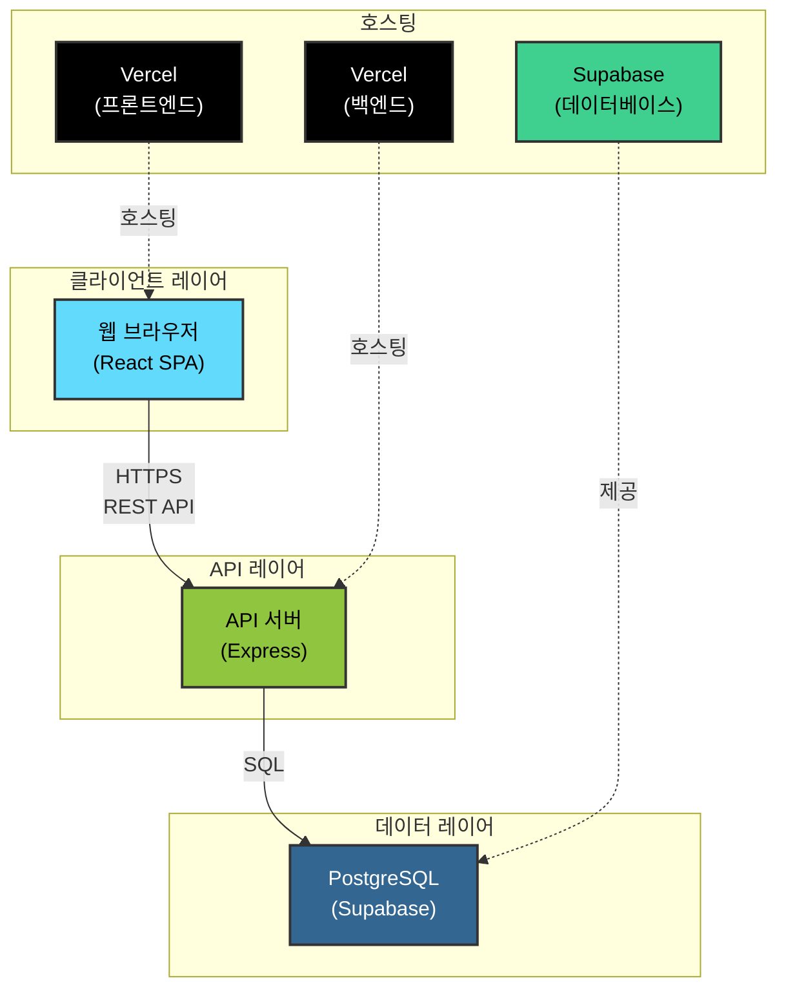
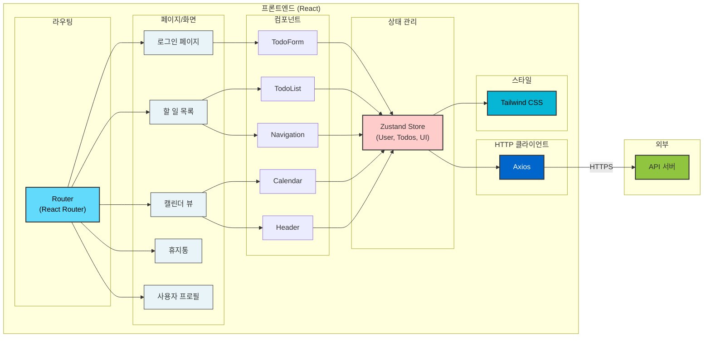
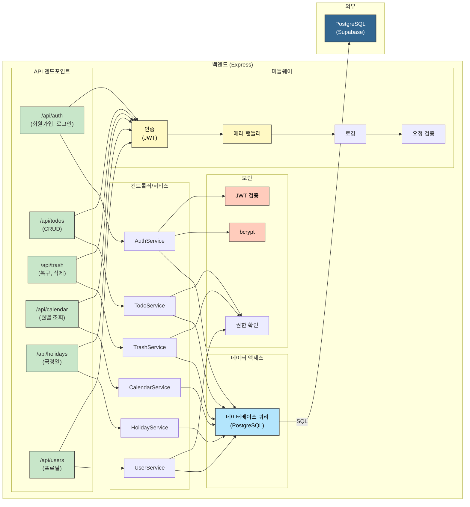
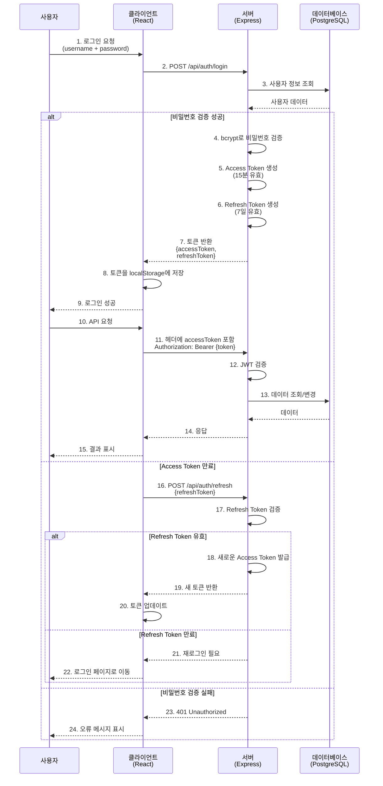
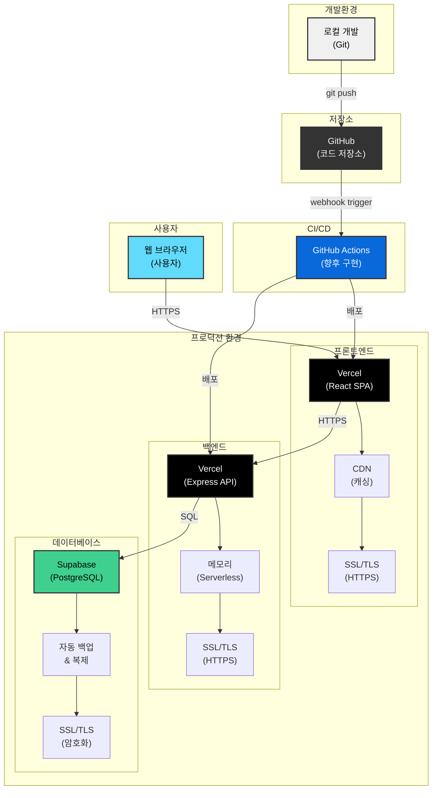
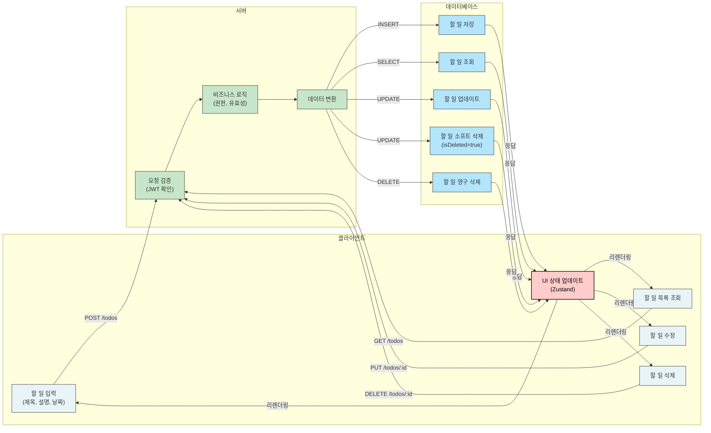
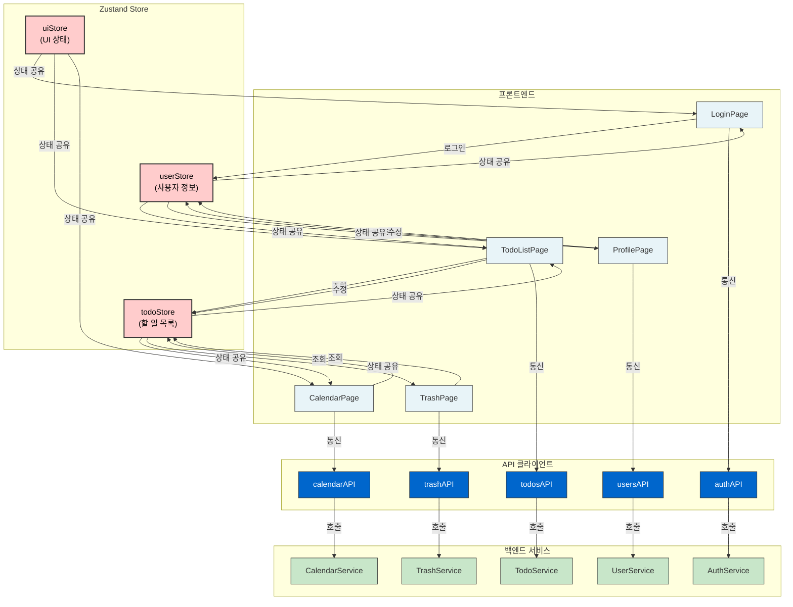
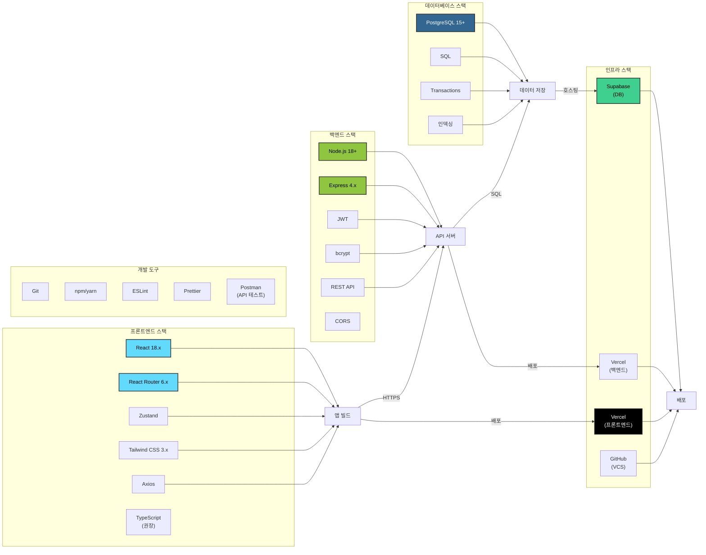
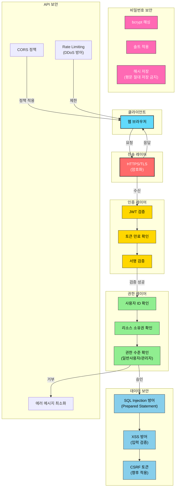
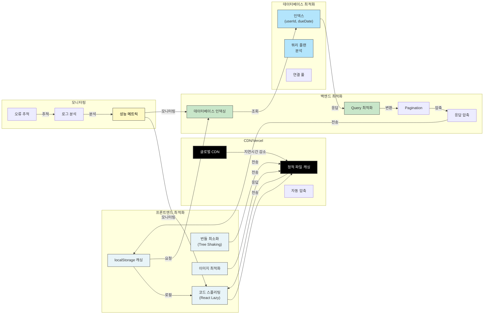

# cjy-todoList 기술 아키텍처 다이어그램

---

## 문서 정보

| 항목       | 내용                        |
| ---------- | --------------------------- |
| **문서명** | 기술 아키텍처 다이어그램    |
| **버전**   | 1.0                         |
| **작성일** | 2025-11-26                  |
| **작성자** | technical-writer            |
| **상태**   | 완성                        |
| **참고**   | [PRD 문서](./3-prd.md)      |

---

## 개요

이 문서는 cjy-todoList 프로젝트의 기술 아키텍처를 Mermaid 다이어그램으로 시각화합니다.

**기술 스택 요약**
- **프론트엔드**: React, Zustand, Tailwind CSS, Axios, React Router
- **백엔드**: Node.js, Express, REST API, JWT, bcrypt
- **데이터베이스**: PostgreSQL (Supabase)
- **인프라**: Vercel (프론트엔드/백엔드), Supabase (데이터베이스)

---

## 1. 시스템 아키텍처

전체 시스템의 레이어 구조를 나타내는 다이어그램입니다.

**설명**
- 클라이언트(React)가 HTTPS를 통해 백엔드 API 서버로 요청을 전달
- 백엔드 서버(Express)가 SQL을 통해 PostgreSQL 데이터베이스와 통신
- 각 계층은 독립적으로 배포되며 HTTPS로 보호됨

---

## 2. 프론트엔드 구조

React 기반 프론트엔드의 주요 계층 구조입니다.

**설명**
- **Pages**: 라우트별 페이지 컴포넌트 (로그인, 할 일 목록, 캘린더, 휴지통 등)
- **Components**: 재사용 가능한 UI 컴포넌트
- **Store (Zustand)**: 전역 상태 관리 (사용자, 할 일, UI 상태 등)
- **API Client (Axios)**: 백엔드 API 통신
- **Router (React Router)**: 클라이언트 사이드 라우팅

---

## 3. 백엔드 구조

Express 기반 백엔드의 주요 계층 구조입니다.

**설명**
- **Routes**: API 엔드포인트 정의 (인증, 할 일, 캘린더, 휴지통 등)
- **Controllers**: 비즈니스 로직 처리
- **Services**: 데이터 처리 및 비즈니스 규칙 적용
- **Database**: PostgreSQL과의 데이터 상호작용
- **Middleware**: 인증(JWT), 에러 처리, 로깅 등

---

## 4. 인증 플로우

사용자 인증 및 JWT 토큰 관리 프로세스입니다.

**설명**
1. 사용자가 로그인 요청 (username/email + password)
2. 서버가 비밀번호 검증 (bcrypt)
3. 서버가 Access Token + Refresh Token 발급
4. 클라이언트가 토큰을 localStorage/cookie에 저장
5. 이후 API 요청에 Access Token을 Header에 포함
6. 서버가 JWT를 검증하여 요청 처리
7. Access Token 만료 시 Refresh Token으로 갱신

---

## 5. 배포 구조

프로젝트의 인프라 및 배포 구조입니다.

**설명**
- **프론트엔드 배포**: Vercel (자동 배포, CDN, SSL)
- **백엔드 배포**: Vercel (Serverless Functions 또는 Docker)
- **데이터베이스 호스팅**: Supabase PostgreSQL (자동 백업, 복제)
- **도메인 관리**: DNS 설정 및 HTTPS 암호화
- **버전 관리**: GitHub 저장소에서 소스 코드 관리

---

## 6. 데이터 흐름

할 일 조회, 생성, 수정, 삭제의 전체 데이터 흐름입니다.

**설명**
- **조회**: 클라이언트가 할 일 목록 요청 → 서버가 필터링하여 반환
- **생성**: 새 할 일 입력 → 서버 검증 → DB 저장 → 상태 업데이트
- **수정**: 할 일 정보 변경 → 서버 검증 → DB 업데이트 → 상태 반영
- **삭제**: 휴지통으로 이동 (소프트 삭제) 또는 영구 삭제

---

## 7. 컴포넌트 상호작용

주요 기능별 컴포넌트 및 서비스의 상호작용입니다.

**설명**
- 각 페이지는 독립적인 컴포넌트로 구성
- Zustand Store를 통한 전역 상태 관리
- Axios를 통한 API 통신
- 각 서비스는 특정 도메인의 비즈니스 로직 담당

---

## 8. 기술 스택 매핑

PRD의 기술 스택을 시각화한 다이어그램입니다.

**설명**
각 레이어별 사용 기술과 버전:
- **프론트엔드**: React 18.x, TypeScript (권장), Zustand, Tailwind CSS 3.x
- **백엔드**: Node.js 18+, Express 4.x, PostgreSQL 15+
- **인프라**: Vercel Free Tier, Supabase Free Tier
- **개발 도구**: Git, npm/yarn, ESLint, Prettier

---

## 9. 보안 아키텍처

인증, 권한, 데이터 보호를 포함한 보안 구조입니다.

**설명**
- **인증**: JWT 기반 토큰 인증 (Access Token + Refresh Token)
- **비밀번호**: bcrypt로 해싱하여 저장
- **전송 보안**: HTTPS/TLS로 암호화된 통신
- **권한 관리**: 사용자는 자신의 데이터만 접근 가능
- **API 보안**: 토큰 검증, CORS 정책, Rate Limiting
- **데이터 보호**: SQL Injection 방어, XSS 방어

---

## 10. 성능 및 확장성

캐싱, 최적화, 확장성을 고려한 아키텍처입니다.

**설명**
- **프론트엔드 캐싱**: CDN을 통한 정적 파일 캐싱
- **브라우저 캐싱**: localStorage에 할 일 데이터 임시 저장
- **API 응답 캐싱**: 불변 데이터 캐싱
- **데이터베이스 인덱싱**: userId, dueDate 등 주요 컬럼 인덱싱
- **Pagination**: 대량의 데이터 처리 시 페이지네이션
- **Lazy Loading**: 캘린더 등 대규모 데이터 지연 로딩

---

## 다이어그램 범례

| 색상                                                                     | 의미                |
| ------- | ---------------------- |
| █ | React/프론트엔드    |
| █ | Node.js/Express     |
| █ | PostgreSQL/데이터베이스 |
| █    | Vercel              |
| █ | Supabase            |
| █ | 상태 관리 (Zustand) |
| █ | 인증/보안           |

---

## 참고 문서

- [PRD 문서](./3-prd.md) - 제품 요구사항 및 기술 스택
- [도메인 정의서](./1-domain-definition.md) - 도메인 모델 및 엔티티
- [API 명세서](./4-api-spec.md) - REST API 엔드포인트 (작성 예정)

---

## 수정 이력

| 버전 | 날짜       | 작성자           | 변경 내용        |
| ---- | ---------- | ---------------- | -------- |
| 1.0  | 2025-11-26 | technical-writer | 초안 작성 |

---

**END OF DOCUMENT**
