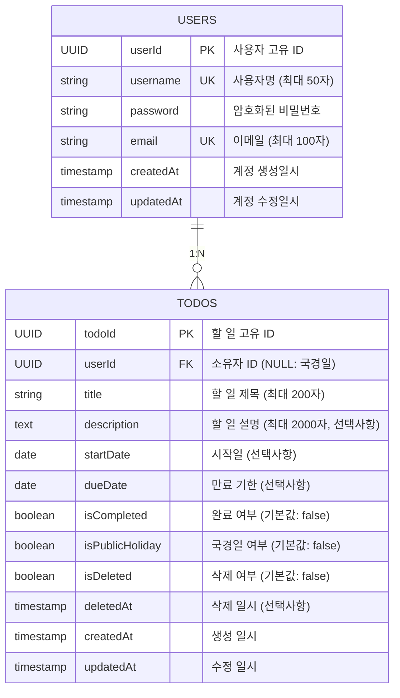

# cjy-todoList ERD (Entity Relationship Diagram)

---

## 문서 정보

| 항목       | 내용                              |
| ---------- | --------------------------------- |
| **문서명** | cjy-todoList 엔티티 관계 다이어그램 |
| **버전**   | 1.0                               |
| **작성일** | 2025-11-26                        |
| **작성자** | 시스템 아키텍처 팀                |
| **검토자** | yoon                              |
| **상태**   | 완성                              |

---

## 1. 개요

cjy-todoList 애플리케이션의 데이터베이스 구조를 시각화하는 엔티티 관계 다이어그램(ERD)입니다.

**주요 특징:**
- Users와 Todos 간의 1:N 관계
- 국경일(isPublicHoliday=true)은 userId가 NULL인 Todos 레코드로 관리
- 소프트 삭제(Soft Delete) 방식을 통한 휴지통 기능 지원
- UUID 기반의 primary key 사용

---

## 2. ERD 다이어그램



---

## 3. 엔티티 상세 정의

### 3.1 Users 엔티티

사용자 계정 정보를 관리하는 테이블입니다. 모든 사용자는 고유한 userId로 식별되며, 안전한 인증 메커니즘을 통해 보호됩니다.

#### 컬럼 정의

| 컬럼      | 타입         | 제약 조건          | 설명                                      |
| --------- | ------------ | ------------------ | ----------------------------------------- |
| userId    | UUID         | PRIMARY KEY        | 사용자 고유 ID (자동 생성)                |
| username  | VARCHAR(50)  | UNIQUE, NOT NULL   | 사용자명 (중복 불허, 필수)               |
| password  | VARCHAR(255) | NOT NULL           | bcrypt로 암호화된 비밀번호 (필수)        |
| email     | VARCHAR(100) | UNIQUE, NOT NULL   | 이메일 주소 (중복 불허, 필수)            |
| createdAt | TIMESTAMP    | DEFAULT NOW()      | 계정 생성 일시 (자동 기록)                |
| updatedAt | TIMESTAMP    | DEFAULT NOW()      | 계정 마지막 수정 일시 (자동 업데이트)    |

#### 비즈니스 규칙

- **BR-11**: 사용자 계정은 회원가입 시 자동 생성
- **C-01**: 비밀번호는 bcrypt를 사용하여 암호화 후 저장 (평문 저장 금지)
- **C-11**: 사용자명(username)은 시스템 내에서 고유해야 함
- 이메일 또한 시스템 내에서 고유해야 하며, 추후 이메일 인증 확장 시 검증 필드 추가 가능

---

### 3.2 Todos 엔티티

사용자의 할 일 및 국경일 정보를 관리하는 테이블입니다. 소프트 삭제 방식을 통해 삭제된 할 일을 휴지통에 보관할 수 있습니다.

#### 컬럼 정의

| 컬럼            | 타입         | 제약 조건          | 설명                                            |
| --------------- | ------------ | ------------------ | ----------------------------------------------- |
| todoId          | UUID         | PRIMARY KEY        | 할 일 고유 ID (자동 생성)                       |
| userId          | UUID         | FOREIGN KEY, NULL  | 소유자 ID (NULL이면 국경일)                     |
| title           | VARCHAR(200) | NOT NULL           | 할 일 제목 (필수, 최대 200자)                   |
| description     | TEXT         | NULL               | 할 일 상세 설명 (선택사항, 최대 2000자)         |
| startDate       | DATE         | NULL               | 시작일 (선택사항, 과거 날짜 입력 가능)          |
| dueDate         | DATE         | NULL               | 만료 기한 (선택사항, startDate 이후여야 함)     |
| isCompleted     | BOOLEAN      | DEFAULT FALSE      | 완료 여부 (기본값: false)                       |
| isPublicHoliday | BOOLEAN      | DEFAULT FALSE      | 국경일 여부 (기본값: false)                     |
| isDeleted       | BOOLEAN      | DEFAULT FALSE      | 소프트 삭제 여부 (기본값: false)                |
| deletedAt       | TIMESTAMP    | NULL               | 삭제 일시 (삭제 시에만 기록)                    |
| createdAt       | TIMESTAMP    | DEFAULT NOW()      | 생성 일시 (자동 기록)                           |
| updatedAt       | TIMESTAMP    | DEFAULT NOW()      | 마지막 수정 일시 (자동 업데이트)                |

#### 비즈니스 규칙

- **BR-01**: 로그인한 사용자만 할 일 접근 가능
- **BR-02**: 본인이 생성한 할 일만 수정/삭제 가능 (국경일은 예외)
- **BR-03**: 관리자만 국경일 수정/삭제 가능
- **BR-04**: 할 일 제목(title)은 필수 입력 항목
- **BR-05**: 과거 날짜도 startDate/dueDate로 입력 가능
- **BR-06**: 사용자는 자신의 할 일과 국경일을 함께 조회
- **BR-07**: 삭제 시 즉시 제거되지 않고 휴지통으로 이동 (소프트 삭제)
- **BR-08**: 휴지통의 할 일은 복구 또는 영구 삭제 가능
- **BR-09**: 영구 삭제된 할 일은 복구 불가능
- **BR-10**: 정상 조회 시 isDeleted=false인 항목만 표시
- **BR-11**: userId=NULL인 todos는 모든 사용자에게 공통으로 표시 (국경일)
- **BR-13**: 국경일은 모든 사용자에게 동일하게 표시되어야 함
- **BR-15**: 만료 기한(dueDate)이 없는 할 일은 캘린더에 표시되지 않음
- **BR-16**: 삭제된 할 일(isDeleted=true)은 캘린더에 표시되지 않음
- **C-09**: 할 일 제목 최대 200자 제한
- **C-10**: 할 일 설명 최대 2000자 제한
- **C-12**: dueDate >= startDate 제약 조건 (만료일이 시작일 이후여야 함)
- **C-15**: 완료된 할 일(isCompleted=true)은 수정 및 삭제 불가

---

## 4. 관계(Relationship) 정의

### 4.1 Users - Todos 관계

**관계 유형:** 1:N (일대다)

```
Users (1) ---< (N) Todos
```

#### 관계 설명

- 한 명의 사용자는 여러 개의 할 일을 소유할 수 있음
- 각 할 일은 정확히 한 명의 사용자에게 소속되거나 국경일(userId=NULL)임

#### 참조 무결성(Referential Integrity)

**Foreign Key 정의:**
```sql
ALTER TABLE todos
ADD CONSTRAINT fk_todos_user_id
FOREIGN KEY (userId) REFERENCES users(userId)
ON DELETE CASCADE
ON UPDATE CASCADE;
```

**특징:**
- `userId`는 NULL 값을 허용 (국경일 구현을 위함)
- NULL 값은 "어떤 사용자도 소유하지 않음"을 의미 → 국경일(모든 사용자가 공유)
- 사용자 삭제 시: 모든 관련 할 일들이 함께 삭제됨 (CASCADE DELETE 적용)
- 사용자 정보 수정 시: 관련 할 일의 userId도 함께 업데이트됨 (CASCADE UPDATE 적용)
```

---

## 5. 제약 조건(Constraints)

### 5.1 Primary Key 제약

| 테이블 | 컬럼   | 설명                     |
| ------ | ------ | ------------------------ |
| Users  | userId | 사용자 고유 ID (UUID)    |
| Todos  | todoId | 할 일 고유 ID (UUID)     |

**구현:**
- UUID는 애플리케이션 레이어 또는 데이터베이스에서 자동 생성
- PostgreSQL `uuid-ossp` 확장 사용 권장

```sql
CREATE EXTENSION IF NOT EXISTS "uuid-ossp";

CREATE TABLE users (
    userId UUID PRIMARY KEY DEFAULT uuid_generate_v4(),
    ...
);

CREATE TABLE todos (
    todoId UUID PRIMARY KEY DEFAULT uuid_generate_v4(),
    ...
);
```

### 5.2 Unique Key 제약

| 테이블 | 컬럼     | 설명                    |
| ------ | -------- | ----------------------- |
| Users  | username | 사용자명 (중복 불허)    |
| Users  | email    | 이메일 (중복 불허)      |

**구현:**
```sql
CREATE TABLE users (
    userId UUID PRIMARY KEY,
    username VARCHAR(50) UNIQUE NOT NULL,
    email VARCHAR(100) UNIQUE NOT NULL,
    ...
);
```

### 5.3 Foreign Key 제약

| 테이블 | 컬럼   | 참조 테이블 | 참조 컬럼 | 설명                    |
| ------ | ------ | ----------- | --------- | ----------------------- |
| Todos  | userId | Users       | userId    | 할 일 소유자 (NULL 허용) |

### 5.4 Default Value 제약

| 테이블 | 컬럼            | 기본값     | 설명                    |
| ------ | --------------- | ---------- | ----------------------- |
| Users  | createdAt       | NOW()      | 계정 생성 일시 자동 기록 |
| Users  | updatedAt       | NOW()      | 계정 수정 일시 자동 기록 |
| Todos  | isCompleted     | FALSE      | 신규 할 일은 미완료     |
| Todos  | isPublicHoliday | FALSE      | 신규 항목은 국경일 아님  |
| Todos  | isDeleted       | FALSE      | 신규 할 일은 미삭제     |
| Todos  | createdAt       | NOW()      | 할 일 생성 일시 자동 기록 |
| Todos  | updatedAt       | NOW()      | 할 일 수정 일시 자동 기록 |

### 5.5 Check 제약

| 테이블 | 조건                           | 설명                    |
| ------ | ------------------------------ | ----------------------- |
| Todos  | startDate <= dueDate OR dueDate IS NULL | 시작일이 종료일보다 이전이거나 종료일이 없어야 함 |
| Todos  | deletedAt IS NULL OR isDeleted=TRUE | 삭제되지 않으면 deletedAt은 NULL이어야 함 |

---

## 6. 소프트 삭제(Soft Delete) 메커니즘

### 6.1 개요

Todos 테이블은 소프트 삭제 방식을 사용하여 삭제된 데이터를 휴지통에 보관합니다.

### 6.2 동작 방식

#### 삭제 프로세스
```
1. 사용자가 할 일 삭제 요청
2. 시스템: isDeleted = TRUE, deletedAt = NOW() 설정
3. 데이터베이스: 레코드 업데이트 (물리적 삭제 아님)
4. 휴지통에 항목 추가됨
```

#### 복구 프로세스
```
1. 사용자가 휴지통에서 할 일 복구 요청
2. 시스템: isDeleted = FALSE, deletedAt = NULL 설정
3. 데이터베이스: 레코드 업데이트
4. 정상 할 일 목록에 복원됨
```

#### 영구 삭제 프로세스
```
1. 사용자가 휴지통에서 영구 삭제 요청
2. 시스템: 데이터베이스에서 레코드 물리적 삭제
3. 복구 불가능한 상태
```

### 6.3 쿼리 영향

#### 정상 할 일 조회
```sql
SELECT * FROM todos
WHERE userId = $1
  AND isDeleted = FALSE
  AND isPublicHoliday = FALSE

UNION ALL

SELECT * FROM todos
WHERE userId IS NULL
  AND isDeleted = FALSE
  AND isPublicHoliday = TRUE;
```

#### 휴지통 조회
```sql
SELECT * FROM todos
WHERE userId = $1
  AND isDeleted = TRUE;
```

### 6.4 이점

- **데이터 복구 가능**: 실수로 삭제한 데이터 복구 가능
- **감사 추적**: deletedAt으로 삭제 시각 기록 가능
- **사용자 경험 개선**: 휴지통을 통한 안전한 삭제 경험
- **데이터 보존**: 통계 및 분석 목적으로 삭제된 데이터 활용 가능

---

## 7. 국경일(Public Holiday) 관리

### 7.1 구현 방식

국경일은 별도의 테이블이 아닌 Todos 테이블의 특수한 레코드로 관리됩니다.

### 7.2 국경일 식별 조건

국경일은 다음 조건을 모두 만족하는 Todos 레코드입니다:

```
WHERE userId IS NULL
  AND isPublicHoliday = TRUE
  AND isDeleted = FALSE
```

### 7.3 국경일 특성

| 특성                | 설명                                    |
| ------------------- | --------------------------------------- |
| **소유자**          | 없음 (userId = NULL)                    |
| **표시 범위**       | 모든 사용자에게 동일하게 표시            |
| **생성 권한**       | 관리자만 생성 가능                      |
| **수정 권한**       | 관리자만 수정 가능                      |
| **삭제 권한**       | 관리자만 삭제 가능                      |
| **사용자 완료 불가**| 사용자는 국경일을 완료 처리할 수 없음    |

### 7.4 국경일 조회 쿼리

```sql
-- 특정 연월의 국경일 조회
SELECT todoId, title, dueDate
FROM todos
WHERE userId IS NULL
  AND isPublicHoliday = TRUE
  AND isDeleted = FALSE
  AND EXTRACT(YEAR FROM dueDate) = $1
  AND EXTRACT(MONTH FROM dueDate) = $2;
```

---

## 8. 데이터 모델링 주요 결정사항

### 8.1 UUID vs Auto Increment

**선택**: UUID 사용

**이유:**
- 분산 시스템에서의 고유성 보장
- 보안: ID 예측 불가능
- 마이크로서비스 아키텍처 확장성

### 8.2 소프트 삭제 vs 물리 삭제

**선택**: 소프트 삭제 + 물리 삭제 복합 방식

**구현:**
- 사용자 삭제: 소프트 삭제 (휴지통)
- 영구 삭제: 물리 삭제 (휴지통에서 완전 제거)

**이유:**
- 사용자 경험 개선 (실수 방지)
- 데이터 보존 (감사 추적)
- 통계 데이터 보존

### 8.3 국경일 테이블 분리 vs 통합

**선택**: Todos 테이블에 통합 (userId=NULL로 구분)

**이유:**
- 스키마 단순화
- 쿼리 복잡도 감소
- 구현 난이도 낮음
- 향후 기능 확장 용이 (사용자별 국경일 커스터마이징 등)

---

## 9. 데이터베이스 생성 스크립트

### 9.1 UUID 확장 모듈

```sql
CREATE EXTENSION IF NOT EXISTS "uuid-ossp";
```

### 9.2 Users 테이블

```sql
CREATE TABLE users (
    -- Primary Key
    userId UUID PRIMARY KEY DEFAULT uuid_generate_v4(),

    -- 사용자 정보
    username VARCHAR(50) NOT NULL,
    password VARCHAR(255) NOT NULL,
    email VARCHAR(100) NOT NULL,

    -- 타임스탬프
    createdAt TIMESTAMP NOT NULL DEFAULT NOW(),
    updatedAt TIMESTAMP NOT NULL DEFAULT NOW(),

    -- 제약 조건
    CONSTRAINT uk_users_username UNIQUE (username),
    CONSTRAINT uk_users_email UNIQUE (email),
    CONSTRAINT chk_users_username_length CHECK (LENGTH(username) >= 1 AND LENGTH(username) <= 50),
    CONSTRAINT chk_users_email_format CHECK (email ~* '^[A-Za-z0-9._%+-]+@[A-Za-z0-9.-]+\.[A-Za-z]{2,}$')
);

-- 사용자 테이블 코멘트
COMMENT ON TABLE users IS '사용자 계정 정보';
COMMENT ON COLUMN users.userId IS '사용자 고유 ID (UUID)';
COMMENT ON COLUMN users.username IS '사용자명 (최대 50자, 고유값)';
COMMENT ON COLUMN users.password IS 'bcrypt로 암호화된 비밀번호';
COMMENT ON COLUMN users.email IS '이메일 주소 (최대 100자, 고유값)';
COMMENT ON COLUMN users.createdAt IS '계정 생성 일시';
COMMENT ON COLUMN users.updatedAt IS '계정 마지막 수정 일시';

-- Users 테이블 인덱스
CREATE INDEX idx_users_username ON users(username);
CREATE INDEX idx_users_email ON users(email);
CREATE INDEX idx_users_created_at ON users(createdAt);
```

### 9.3 Todos 테이블

```sql
CREATE TABLE todos (
    -- Primary Key
    todoId UUID PRIMARY KEY DEFAULT uuid_generate_v4(),

    -- Foreign Key (NULL 허용 - 국경일)
    userId UUID,

    -- 할 일 정보
    title VARCHAR(200) NOT NULL,
    description TEXT,

    -- 날짜 정보
    startDate DATE,
    dueDate DATE,

    -- 상태 플래그
    isCompleted BOOLEAN NOT NULL DEFAULT FALSE,
    isPublicHoliday BOOLEAN NOT NULL DEFAULT FALSE,
    isDeleted BOOLEAN NOT NULL DEFAULT FALSE,

    -- 타임스탬프
    deletedAt TIMESTAMP,
    createdAt TIMESTAMP NOT NULL DEFAULT NOW(),
    updatedAt TIMESTAMP NOT NULL DEFAULT NOW(),

    -- 제약 조건
    CONSTRAINT fk_todos_user_id
        FOREIGN KEY (userId)
        REFERENCES users(userId)
        ON DELETE CASCADE
        ON UPDATE CASCADE,

    CONSTRAINT chk_todos_title_length
        CHECK (LENGTH(title) >= 1 AND LENGTH(title) <= 200),

    CONSTRAINT chk_todos_description_length
        CHECK (description IS NULL OR LENGTH(description) <= 2000),

    CONSTRAINT chk_todos_dates
        CHECK (
            startDate IS NULL OR
            dueDate IS NULL OR
            startDate <= dueDate
        ),

    CONSTRAINT chk_todos_delete_consistency
        CHECK (
            (isDeleted = FALSE AND deletedAt IS NULL) OR
            (isDeleted = TRUE AND deletedAt IS NOT NULL)
        ),

    CONSTRAINT chk_todos_public_holiday
        CHECK (
            (isPublicHoliday = FALSE) OR
            (isPublicHoliday = TRUE AND userId IS NULL)
        )
);

-- Todos 테이블 코멘트
COMMENT ON TABLE todos IS '할 일 및 국경일 정보';
COMMENT ON COLUMN todos.todoId IS '할 일 고유 ID (UUID)';
COMMENT ON COLUMN todos.userId IS '소유자 ID (NULL이면 국경일)';
COMMENT ON COLUMN todos.title IS '할 일 제목 (최대 200자, 필수)';
COMMENT ON COLUMN todos.description IS '할 일 상세 설명 (최대 2000자, 선택사항)';
COMMENT ON COLUMN todos.startDate IS '시작일 (선택사항)';
COMMENT ON COLUMN todos.dueDate IS '만료 기한 (선택사항, startDate 이후여야 함)';
COMMENT ON COLUMN todos.isCompleted IS '완료 여부 (기본값: false)';
COMMENT ON COLUMN todos.isPublicHoliday IS '국경일 여부 (기본값: false)';
COMMENT ON COLUMN todos.isDeleted IS '소프트 삭제 여부 (기본값: false)';
COMMENT ON COLUMN todos.deletedAt IS '삭제 일시 (삭제 시에만 기록)';
COMMENT ON COLUMN todos.createdAt IS '생성 일시';
COMMENT ON COLUMN todos.updatedAt IS '마지막 수정 일시';

-- Todos 테이블 인덱스
-- 단일 컬럼 인덱스
CREATE INDEX idx_todos_user_id ON todos(userId);
CREATE INDEX idx_todos_is_deleted ON todos(isDeleted);
CREATE INDEX idx_todos_is_completed ON todos(isCompleted);
CREATE INDEX idx_todos_is_public_holiday ON todos(isPublicHoliday);
CREATE INDEX idx_todos_due_date ON todos(dueDate);
CREATE INDEX idx_todos_start_date ON todos(startDate);
CREATE INDEX idx_todos_created_at ON todos(createdAt);
CREATE INDEX idx_todos_updated_at ON todos(updatedAt);

-- 복합 인덱스 (쿼리 최적화)
-- 사용자별 정상 할 일 조회용
CREATE INDEX idx_todos_user_active ON todos(userId, isDeleted, isCompleted)
    WHERE isDeleted = FALSE;

-- 캘린더 조회용
CREATE INDEX idx_todos_calendar ON todos(dueDate, isDeleted, userId)
    WHERE isDeleted = FALSE AND dueDate IS NOT NULL;

-- 국경일 조회용
CREATE INDEX idx_todos_public_holidays ON todos(dueDate, isPublicHoliday)
    WHERE userId IS NULL AND isPublicHoliday = TRUE AND isDeleted = FALSE;

-- 휴지통 조회용
CREATE INDEX idx_todos_trash ON todos(userId, isDeleted, deletedAt)
    WHERE isDeleted = TRUE;
```

### 9.4 Refresh Tokens 테이블

```sql
CREATE TABLE refresh_tokens (
    -- Primary Key
    tokenId UUID PRIMARY KEY DEFAULT uuid_generate_v4(),

    -- Foreign Key
    userId UUID NOT NULL,

    -- 토큰 정보
    token VARCHAR(255) NOT NULL,
    expiresAt TIMESTAMP NOT NULL,

    -- 타임스탬프
    createdAt TIMESTAMP NOT NULL DEFAULT NOW(),
    updatedAt TIMESTAMP NOT NULL DEFAULT NOW(),

    -- 제약 조건
    CONSTRAINT fk_refresh_tokens_user_id
        FOREIGN KEY (userId)
        REFERENCES users(userId)
        ON DELETE CASCADE
        ON UPDATE CASCADE,

    CONSTRAINT uk_refresh_tokens_token UNIQUE (token)
);

-- Refresh Tokens 테이블 코멘트
COMMENT ON TABLE refresh_tokens IS 'JWT Refresh 토큰 정보';
COMMENT ON COLUMN refresh_tokens.tokenId IS 'Refresh 토큰 고유 ID (UUID)';
COMMENT ON COLUMN refresh_tokens.userId IS '사용자 ID (FK)';
COMMENT ON COLUMN refresh_tokens.token IS 'Refresh 토큰 값 (JWT)';
COMMENT ON COLUMN refresh_tokens.expiresAt IS '토큰 만료 일시';
COMMENT ON COLUMN refresh_tokens.createdAt IS '토큰 생성 일시';
COMMENT ON COLUMN refresh_tokens.updatedAt IS '토큰 마지막 수정 일시';

-- Refresh Tokens 테이블 인덱스
CREATE INDEX idx_refresh_tokens_user_id ON refresh_tokens(userId);
CREATE INDEX idx_refresh_tokens_token ON refresh_tokens(token);
CREATE INDEX idx_refresh_tokens_expires_at ON refresh_tokens(expiresAt);
```

### 9.5 트리거 함수

```sql
-- updatedAt 자동 업데이트 함수
CREATE OR REPLACE FUNCTION update_updated_at_column()
RETURNS TRIGGER AS $$
BEGIN
    NEW.updatedAt = NOW();
    RETURN NEW;
END;
$$ LANGUAGE plpgsql;

-- Users 테이블에 트리거 적용
CREATE TRIGGER trg_users_updated_at
    BEFORE UPDATE ON users
    FOR EACH ROW
    EXECUTE FUNCTION update_updated_at_column();

-- Todos 테이블에 트리거 적용
CREATE TRIGGER trg_todos_updated_at
    BEFORE UPDATE ON todos
    FOR EACH ROW
    EXECUTE FUNCTION update_updated_at_column();

-- Refresh Tokens 테이블에 트리거 적용
CREATE TRIGGER trg_refresh_tokens_updated_at
    BEFORE UPDATE ON refresh_tokens
    FOR EACH ROW
    EXECUTE FUNCTION update_updated_at_column();
```

### 9.6 뷰 (View)

```sql
-- 활성 할 일 뷰 (삭제되지 않은 할 일)
CREATE OR REPLACE VIEW v_active_todos AS
SELECT
    todoId,
    userId,
    title,
    description,
    startDate,
    dueDate,
    isCompleted,
    isPublicHoliday,
    createdAt,
    updatedAt
FROM todos
WHERE isDeleted = FALSE;

COMMENT ON VIEW v_active_todos IS '삭제되지 않은 활성 할 일 목록';

-- 국경일 뷰
CREATE OR REPLACE VIEW v_public_holidays AS
SELECT
    todoId,
    title,
    description,
    dueDate,
    createdAt,
    updatedAt
FROM todos
WHERE userId IS NULL
    AND isPublicHoliday = TRUE
    AND isDeleted = FALSE;

COMMENT ON VIEW v_public_holidays IS '국경일 목록';

-- 휴지통 뷰
CREATE OR REPLACE VIEW v_trash AS
SELECT
    todoId,
    userId,
    title,
    description,
    startDate,
    dueDate,
    isCompleted,
    deletedAt,
    createdAt,
    updatedAt
FROM todos
WHERE isDeleted = TRUE;

COMMENT ON VIEW v_trash IS '휴지통에 있는 할 일 목록';
```

### 9.7 유용한 쿼리 함수

```sql
-- 사용자별 할 일 통계 함수
CREATE OR REPLACE FUNCTION get_user_todo_stats(p_user_id UUID)
RETURNS TABLE (
    total_todos BIGINT,
    completed_todos BIGINT,
    pending_todos BIGINT,
    deleted_todos BIGINT,
    completion_rate NUMERIC
) AS $$
BEGIN
    RETURN QUERY
    SELECT
        COUNT(*) FILTER (WHERE isDeleted = FALSE) as total_todos,
        COUNT(*) FILTER (WHERE isDeleted = FALSE AND isCompleted = TRUE) as completed_todos,
        COUNT(*) FILTER (WHERE isDeleted = FALSE AND isCompleted = FALSE) as pending_todos,
        COUNT(*) FILTER (WHERE isDeleted = TRUE) as deleted_todos,
        ROUND(
            (COUNT(*) FILTER (WHERE isDeleted = FALSE AND isCompleted = TRUE)::NUMERIC /
             NULLIF(COUNT(*) FILTER (WHERE isDeleted = FALSE), 0) * 100),
            2
        ) as completion_rate
    FROM todos
    WHERE userId = p_user_id;
END;
$$ LANGUAGE plpgsql;

COMMENT ON FUNCTION get_user_todo_stats IS '사용자별 할 일 통계 조회';
```

---

## 10. 설계 고려사항

### 10.1 확장성(Scalability)

- **현재:** 2개 테이블, 단순 관계
- **향후:** 카테고리, 태그, 알림 등 기능 추가 시 다음과 같이 확장 가능:
  ```
  Users (1:N) Categories
  Todos (M:N) Tags
  Todos (1:N) Notifications
  Todos (1:N) Comments (공유 기능)
  ```

### 10.2 성능(Performance)

#### 인덱스 전략
- 자주 쿼리되는 컬럼에 인덱스 생성 (userId, isDeleted, dueDate)
- 복합 인덱스 사용으로 캘린더 조회 최적화
- 인덱스 유지 비용과 쿼리 성능 간 균형 고려

#### 파티셔닝
- 데이터 증가 시 dueDate 기준 시간 기반 파티셔닝 고려
- 국경일(userId=NULL) 조회 성능 최적화

### 10.3 보안(Security)

- **민감 정보 보호:** 비밀번호는 bcrypt로 암호화
- **입력 검증:** 애플리케이션 레이어에서 모든 입력 검증
- **SQL Injection 방지:** Prepared Statement 사용
- **권한 검증:** 데이터베이스와 애플리케이션 양쪽에서 권한 확인

### 10.4 무결성(Integrity)

- **제약 조건:** 데이터베이스 레벨에서 비즈니스 규칙 강제
- **트랜잭션:** 중요한 작업은 트랜잭션 내에서 수행
- **일관성:** 소프트 삭제 시 isDeleted와 deletedAt의 일관성 유지

---

## 11. 변경 이력

| 버전 | 날짜       | 작성자     | 변경 내용      |
| ---- | ---------- | ---------- | -------------- |
| 1.0  | 2025-11-26 | 아키텍처팀 | 초안 작성      |

---

## 12. 참고 문서

- [PRD (Product Requirements Document)](./3-prd.md)
- [도메인 정의서](./1-domain-definition.md)

---

**END OF DOCUMENT**
