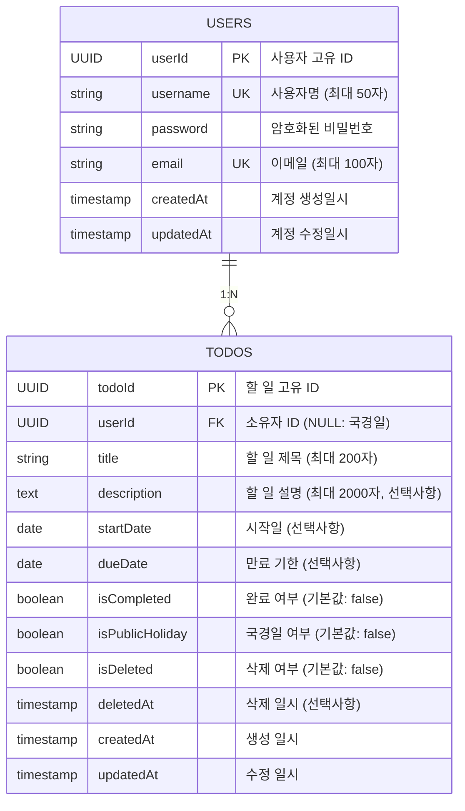

# cjy-todoList ERD (Entity Relationship Diagram)

---

## 문서 정보

| 항목       | 내용                              |
| ---------- | --------------------------------- |
| **문서명** | cjy-todoList 엔티티 관계 다이어그램 |
| **버전**   | 1.0                               |
| **작성일** | 2025-11-26                        |
| **작성자** | 시스템 아키텍처 팀                |
| **검토자** | yoon                              |
| **상태**   | 완성                              |

---

## 1. 개요

cjy-todoList 애플리케이션의 데이터베이스 구조를 시각화하는 엔티티 관계 다이어그램(ERD)입니다.

**주요 특징:**
- Users와 Todos 간의 1:N 관계
- 국경일(isPublicHoliday=true)은 userId가 NULL인 Todos 레코드로 관리
- 소프트 삭제(Soft Delete) 방식을 통한 휴지통 기능 지원
- UUID 기반의 primary key 사용

---

## 2. ERD 다이어그램



---

## 3. 엔티티 상세 정의

### 3.1 Users 엔티티

사용자 계정 정보를 관리하는 테이블입니다. 모든 사용자는 고유한 userId로 식별되며, 안전한 인증 메커니즘을 통해 보호됩니다.

#### 컬럼 정의

| 컬럼      | 타입         | 제약 조건          | 설명                                      |
| --------- | ------------ | ------------------ | ----------------------------------------- |
| userId    | UUID         | PRIMARY KEY        | 사용자 고유 ID (자동 생성)                |
| username  | VARCHAR(50)  | UNIQUE, NOT NULL   | 사용자명 (중복 불허, 필수)               |
| password  | VARCHAR(255) | NOT NULL           | bcrypt로 암호화된 비밀번호 (필수)        |
| email     | VARCHAR(100) | UNIQUE, NOT NULL   | 이메일 주소 (중복 불허, 필수)            |
| createdAt | TIMESTAMP    | DEFAULT NOW()      | 계정 생성 일시 (자동 기록)                |
| updatedAt | TIMESTAMP    | DEFAULT NOW()      | 계정 마지막 수정 일시 (자동 업데이트)    |

#### 비즈니스 규칙

- **BR-11**: 사용자 계정은 회원가입 시 자동 생성
- **C-01**: 비밀번호는 bcrypt를 사용하여 암호화 후 저장 (평문 저장 금지)
- **C-11**: 사용자명(username)은 시스템 내에서 고유해야 함
- 이메일 또한 시스템 내에서 고유해야 하며, 추후 이메일 인증 확장 시 검증 필드 추가 가능

---

### 3.2 Todos 엔티티

사용자의 할 일 및 국경일 정보를 관리하는 테이블입니다. 소프트 삭제 방식을 통해 삭제된 할 일을 휴지통에 보관할 수 있습니다.

#### 컬럼 정의

| 컬럼            | 타입         | 제약 조건          | 설명                                            |
| --------------- | ------------ | ------------------ | ----------------------------------------------- |
| todoId          | UUID         | PRIMARY KEY        | 할 일 고유 ID (자동 생성)                       |
| userId          | UUID         | FOREIGN KEY, NULL  | 소유자 ID (NULL이면 국경일)                     |
| title           | VARCHAR(200) | NOT NULL           | 할 일 제목 (필수, 최대 200자)                   |
| description     | TEXT         | NULL               | 할 일 상세 설명 (선택사항, 최대 2000자)         |
| startDate       | DATE         | NULL               | 시작일 (선택사항, 과거 날짜 입력 가능)          |
| dueDate         | DATE         | NULL               | 만료 기한 (선택사항, startDate 이후여야 함)     |
| isCompleted     | BOOLEAN      | DEFAULT FALSE      | 완료 여부 (기본값: false)                       |
| isPublicHoliday | BOOLEAN      | DEFAULT FALSE      | 국경일 여부 (기본값: false)                     |
| isDeleted       | BOOLEAN      | DEFAULT FALSE      | 소프트 삭제 여부 (기본값: false)                |
| deletedAt       | TIMESTAMP    | NULL               | 삭제 일시 (삭제 시에만 기록)                    |
| createdAt       | TIMESTAMP    | DEFAULT NOW()      | 생성 일시 (자동 기록)                           |
| updatedAt       | TIMESTAMP    | DEFAULT NOW()      | 마지막 수정 일시 (자동 업데이트)                |

#### 비즈니스 규칙

- **BR-01**: 로그인한 사용자만 할 일 접근 가능
- **BR-02**: 본인이 생성한 할 일만 수정/삭제 가능 (국경일은 예외)
- **BR-03**: 관리자만 국경일 수정/삭제 가능
- **BR-04**: 할 일 제목(title)은 필수 입력 항목
- **BR-05**: 과거 날짜도 startDate/dueDate로 입력 가능
- **BR-06**: 사용자는 자신의 할 일과 국경일을 함께 조회
- **BR-07**: 삭제 시 즉시 제거되지 않고 휴지통으로 이동 (소프트 삭제)
- **BR-08**: 휴지통의 할 일은 복구 또는 영구 삭제 가능
- **BR-09**: 영구 삭제된 할 일은 복구 불가능
- **BR-10**: 정상 조회 시 isDeleted=false인 항목만 표시
- **BR-11**: userId=NULL인 todos는 모든 사용자에게 공통으로 표시 (국경일)
- **BR-13**: 국경일은 모든 사용자에게 동일하게 표시되어야 함
- **BR-15**: 만료 기한(dueDate)이 없는 할 일은 캘린더에 표시되지 않음
- **BR-16**: 삭제된 할 일(isDeleted=true)은 캘린더에 표시되지 않음
- **C-09**: 할 일 제목 최대 200자 제한
- **C-10**: 할 일 설명 최대 2000자 제한
- **C-12**: dueDate >= startDate 제약 조건 (만료일이 시작일 이후여야 함)
- **C-15**: 완료된 할 일(isCompleted=true)은 수정 및 삭제 불가

---

## 4. 관계(Relationship) 정의

### 4.1 Users - Todos 관계

**관계 유형:** 1:N (일대다)

```
Users (1) ---< (N) Todos
```

#### 관계 설명

- 한 명의 사용자는 여러 개의 할 일을 소유할 수 있음
- 각 할 일은 정확히 한 명의 사용자에게 소속되거나 국경일(userId=NULL)임

#### 참조 무결성(Referential Integrity)

**Foreign Key 정의:**
```sql
ALTER TABLE todos
ADD CONSTRAINT fk_todos_user_id
FOREIGN KEY (userId) REFERENCES users(userId);
```

**특징:**
- `userId`는 NULL 값을 허용 (국경일 구현을 위함)
- NULL 값은 "어떤 사용자도 소유하지 않음"을 의미 → 국경일(모든 사용자가 공유)
- 사용자 삭제 시: CASCADE DELETE를 적용할지 RESTRICT를 적용할지 정책 결정 필요

**권장 정책:**
```sql
-- 사용자 삭제 시 해당 사용자의 할 일도 함께 삭제 (선택적)
ON DELETE CASCADE

-- 또는 사용자 삭제 시 할 일 삭제 방지 (권장)
ON DELETE RESTRICT
```

---

## 5. 제약 조건(Constraints)

### 5.1 Primary Key 제약

| 테이블 | 컬럼   | 설명                     |
| ------ | ------ | ------------------------ |
| Users  | userId | 사용자 고유 ID (UUID)    |
| Todos  | todoId | 할 일 고유 ID (UUID)     |

**구현:**
- UUID는 애플리케이션 레이어 또는 데이터베이스에서 자동 생성
- PostgreSQL `uuid-ossp` 확장 사용 권장

```sql
CREATE EXTENSION IF NOT EXISTS "uuid-ossp";

CREATE TABLE users (
    userId UUID PRIMARY KEY DEFAULT uuid_generate_v4(),
    ...
);

CREATE TABLE todos (
    todoId UUID PRIMARY KEY DEFAULT uuid_generate_v4(),
    ...
);
```

### 5.2 Unique Key 제약

| 테이블 | 컬럼     | 설명                    |
| ------ | -------- | ----------------------- |
| Users  | username | 사용자명 (중복 불허)    |
| Users  | email    | 이메일 (중복 불허)      |

**구현:**
```sql
CREATE TABLE users (
    userId UUID PRIMARY KEY,
    username VARCHAR(50) UNIQUE NOT NULL,
    email VARCHAR(100) UNIQUE NOT NULL,
    ...
);
```

### 5.3 Foreign Key 제약

| 테이블 | 컬럼   | 참조 테이블 | 참조 컬럼 | 설명                    |
| ------ | ------ | ----------- | --------- | ----------------------- |
| Todos  | userId | Users       | userId    | 할 일 소유자 (NULL 허용) |

### 5.4 Default Value 제약

| 테이블 | 컬럼            | 기본값     | 설명                    |
| ------ | --------------- | ---------- | ----------------------- |
| Users  | createdAt       | NOW()      | 계정 생성 일시 자동 기록 |
| Users  | updatedAt       | NOW()      | 계정 수정 일시 자동 기록 |
| Todos  | isCompleted     | FALSE      | 신규 할 일은 미완료     |
| Todos  | isPublicHoliday | FALSE      | 신규 항목은 국경일 아님  |
| Todos  | isDeleted       | FALSE      | 신규 할 일은 미삭제     |
| Todos  | createdAt       | NOW()      | 할 일 생성 일시 자동 기록 |
| Todos  | updatedAt       | NOW()      | 할 일 수정 일시 자동 기록 |

### 5.5 Check 제약

| 테이블 | 조건                           | 설명                    |
| ------ | ------------------------------ | ----------------------- |
| Todos  | startDate <= dueDate OR dueDate IS NULL | 시작일이 종료일보다 이전이거나 종료일이 없어야 함 |
| Todos  | deletedAt IS NULL OR isDeleted=TRUE | 삭제되지 않으면 deletedAt은 NULL이어야 함 |

---

## 6. 소프트 삭제(Soft Delete) 메커니즘

### 6.1 개요

Todos 테이블은 소프트 삭제 방식을 사용하여 삭제된 데이터를 휴지통에 보관합니다.

### 6.2 동작 방식

#### 삭제 프로세스
```
1. 사용자가 할 일 삭제 요청
2. 시스템: isDeleted = TRUE, deletedAt = NOW() 설정
3. 데이터베이스: 레코드 업데이트 (물리적 삭제 아님)
4. 휴지통에 항목 추가됨
```

#### 복구 프로세스
```
1. 사용자가 휴지통에서 할 일 복구 요청
2. 시스템: isDeleted = FALSE, deletedAt = NULL 설정
3. 데이터베이스: 레코드 업데이트
4. 정상 할 일 목록에 복원됨
```

#### 영구 삭제 프로세스
```
1. 사용자가 휴지통에서 영구 삭제 요청
2. 시스템: 데이터베이스에서 레코드 물리적 삭제
3. 복구 불가능한 상태
```

### 6.3 쿼리 영향

#### 정상 할 일 조회
```sql
SELECT * FROM todos
WHERE userId = $1
  AND isDeleted = FALSE
  AND isPublicHoliday = FALSE

UNION ALL

SELECT * FROM todos
WHERE userId IS NULL
  AND isDeleted = FALSE
  AND isPublicHoliday = TRUE;
```

#### 휴지통 조회
```sql
SELECT * FROM todos
WHERE userId = $1
  AND isDeleted = TRUE;
```

### 6.4 이점

- **데이터 복구 가능**: 실수로 삭제한 데이터 복구 가능
- **감사 추적**: deletedAt으로 삭제 시각 기록 가능
- **사용자 경험 개선**: 휴지통을 통한 안전한 삭제 경험
- **데이터 보존**: 통계 및 분석 목적으로 삭제된 데이터 활용 가능

---

## 7. 국경일(Public Holiday) 관리

### 7.1 구현 방식

국경일은 별도의 테이블이 아닌 Todos 테이블의 특수한 레코드로 관리됩니다.

### 7.2 국경일 식별 조건

국경일은 다음 조건을 모두 만족하는 Todos 레코드입니다:

```
WHERE userId IS NULL
  AND isPublicHoliday = TRUE
  AND isDeleted = FALSE
```

### 7.3 국경일 특성

| 특성                | 설명                                    |
| ------------------- | --------------------------------------- |
| **소유자**          | 없음 (userId = NULL)                    |
| **표시 범위**       | 모든 사용자에게 동일하게 표시            |
| **생성 권한**       | 관리자만 생성 가능                      |
| **수정 권한**       | 관리자만 수정 가능                      |
| **삭제 권한**       | 관리자만 삭제 가능                      |
| **사용자 완료 불가**| 사용자는 국경일을 완료 처리할 수 없음    |

### 7.4 국경일 조회 쿼리

```sql
-- 특정 연월의 국경일 조회
SELECT todoId, title, dueDate
FROM todos
WHERE userId IS NULL
  AND isPublicHoliday = TRUE
  AND isDeleted = FALSE
  AND EXTRACT(YEAR FROM dueDate) = $1
  AND EXTRACT(MONTH FROM dueDate) = $2;
```

---

## 8. 데이터 모델링 주요 결정사항

### 8.1 UUID vs Auto Increment

**선택**: UUID 사용

**이유:**
- 분산 시스템에서의 고유성 보장
- 보안: ID 예측 불가능
- 마이크로서비스 아키텍처 확장성

### 8.2 소프트 삭제 vs 물리 삭제

**선택**: 소프트 삭제 + 물리 삭제 복합 방식

**구현:**
- 사용자 삭제: 소프트 삭제 (휴지통)
- 영구 삭제: 물리 삭제 (휴지통에서 완전 제거)

**이유:**
- 사용자 경험 개선 (실수 방지)
- 데이터 보존 (감사 추적)
- 통계 데이터 보존

### 8.3 국경일 테이블 분리 vs 통합

**선택**: Todos 테이블에 통합 (userId=NULL로 구분)

**이유:**
- 스키마 단순화
- 쿼리 복잡도 감소
- 구현 난이도 낮음
- 향후 기능 확장 용이 (사용자별 국경일 커스터마이징 등)

---

## 9. 데이터베이스 생성 스크립트

### 9.1 Users 테이블

```sql
CREATE TABLE users (
    userId UUID PRIMARY KEY DEFAULT uuid_generate_v4(),
    username VARCHAR(50) UNIQUE NOT NULL,
    password VARCHAR(255) NOT NULL,
    email VARCHAR(100) UNIQUE NOT NULL,
    createdAt TIMESTAMP DEFAULT NOW(),
    updatedAt TIMESTAMP DEFAULT NOW(),

    -- 인덱스
    UNIQUE(username),
    UNIQUE(email)
);

-- 성능 최적화 인덱스
CREATE INDEX idx_users_email ON users(email);
CREATE INDEX idx_users_username ON users(username);
```

### 9.2 Todos 테이블

```sql
CREATE TABLE todos (
    todoId UUID PRIMARY KEY DEFAULT uuid_generate_v4(),
    userId UUID REFERENCES users(userId) ON DELETE CASCADE,
    title VARCHAR(200) NOT NULL,
    description TEXT,
    startDate DATE,
    dueDate DATE,
    isCompleted BOOLEAN DEFAULT FALSE,
    isPublicHoliday BOOLEAN DEFAULT FALSE,
    isDeleted BOOLEAN DEFAULT FALSE,
    deletedAt TIMESTAMP,
    createdAt TIMESTAMP DEFAULT NOW(),
    updatedAt TIMESTAMP DEFAULT NOW(),

    -- 제약 조건
    CONSTRAINT chk_dates
        CHECK (startDate IS NULL OR dueDate IS NULL OR startDate <= dueDate),
    CONSTRAINT chk_delete_consistency
        CHECK (deletedAt IS NULL OR isDeleted = TRUE),

    -- 인덱스
    INDEX idx_todos_user_id (userId),
    INDEX idx_todos_is_deleted (isDeleted),
    INDEX idx_todos_due_date (dueDate),
    INDEX idx_todos_public_holiday (isPublicHoliday),
    INDEX idx_todos_user_deleted_holiday (userId, isDeleted, isPublicHoliday)
);

-- 성능 최적화 인덱스
CREATE INDEX idx_todos_created_at ON todos(createdAt);
CREATE INDEX idx_todos_updated_at ON todos(updatedAt);
CREATE INDEX idx_todos_start_date ON todos(startDate);
```

---

## 10. 설계 고려사항

### 10.1 확장성(Scalability)

- **현재:** 2개 테이블, 단순 관계
- **향후:** 카테고리, 태그, 알림 등 기능 추가 시 다음과 같이 확장 가능:
  ```
  Users (1:N) Categories
  Todos (M:N) Tags
  Todos (1:N) Notifications
  Todos (1:N) Comments (공유 기능)
  ```

### 10.2 성능(Performance)

#### 인덱스 전략
- 자주 쿼리되는 컬럼에 인덱스 생성 (userId, isDeleted, dueDate)
- 복합 인덱스 사용으로 캘린더 조회 최적화
- 인덱스 유지 비용과 쿼리 성능 간 균형 고려

#### 파티셔닝
- 데이터 증가 시 dueDate 기준 시간 기반 파티셔닝 고려
- 국경일(userId=NULL) 조회 성능 최적화

### 10.3 보안(Security)

- **민감 정보 보호:** 비밀번호는 bcrypt로 암호화
- **입력 검증:** 애플리케이션 레이어에서 모든 입력 검증
- **SQL Injection 방지:** Prepared Statement 사용
- **권한 검증:** 데이터베이스와 애플리케이션 양쪽에서 권한 확인

### 10.4 무결성(Integrity)

- **제약 조건:** 데이터베이스 레벨에서 비즈니스 규칙 강제
- **트랜잭션:** 중요한 작업은 트랜잭션 내에서 수행
- **일관성:** 소프트 삭제 시 isDeleted와 deletedAt의 일관성 유지

---

## 11. 변경 이력

| 버전 | 날짜       | 작성자     | 변경 내용      |
| ---- | ---------- | ---------- | -------------- |
| 1.0  | 2025-11-26 | 아키텍처팀 | 초안 작성      |

---

## 12. 참고 문서

- [PRD (Product Requirements Document)](./3-prd.md)
- [도메인 정의서](./1-domain-definition.md)

---

**END OF DOCUMENT**
