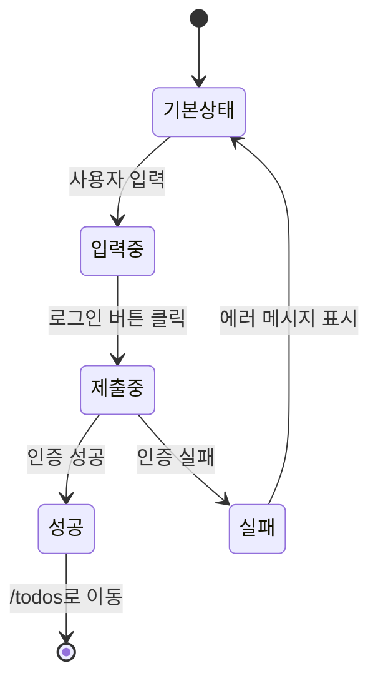
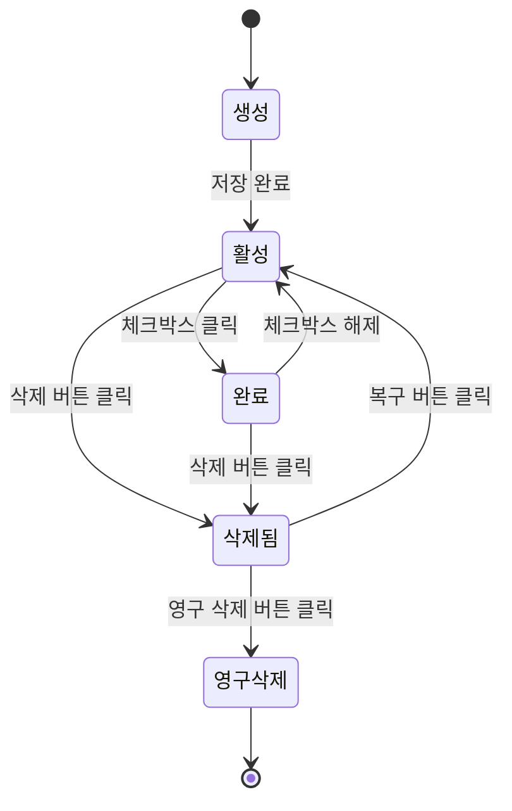
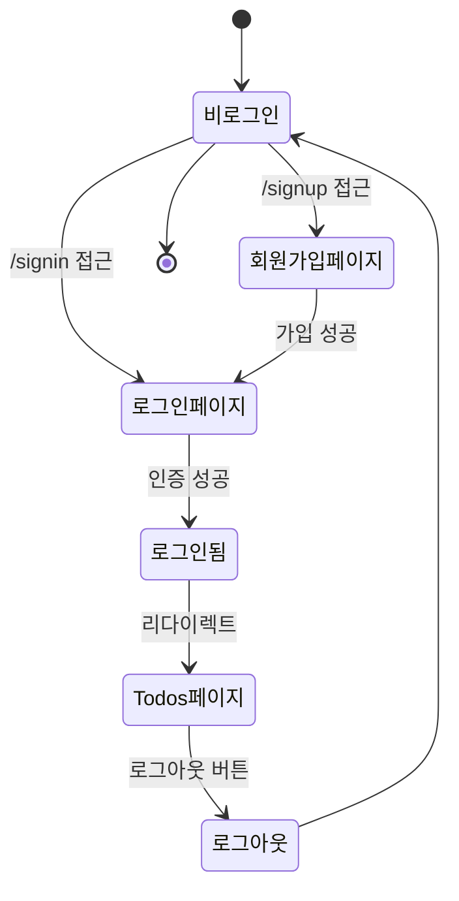
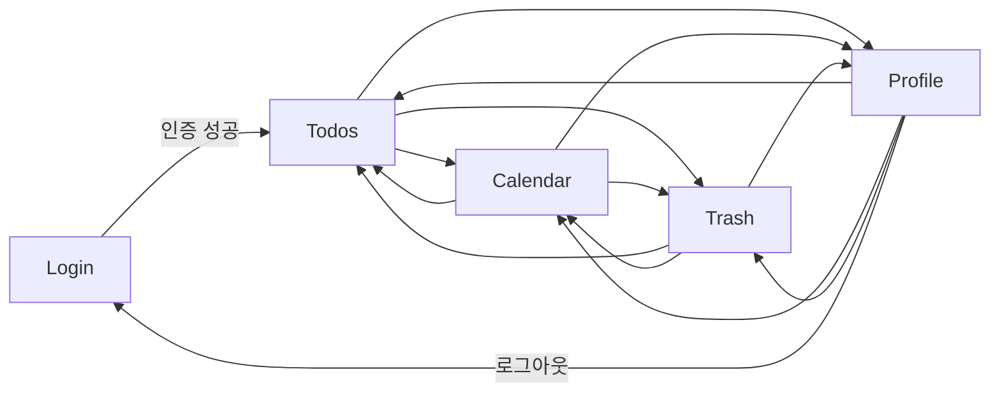

# cjy-todoList 화면별 와이어프레임

---

## 문서 정보

| 항목       | 내용                          |
| ---------- | ----------------------------- |
| **문서명** | cjy-todoList 화면별 와이어프레임 |
| **버전**   | 1.0                           |
| **작성일** | 2025-11-26                    |
| **작성자** | UI/UX Designer                |
| **상태**   | 완성                          |
| **참고**   | PRD v1.0, 사용자 시나리오 v1.0 |

---

## 목차

1. [인증 화면](#1-인증-화면)
   - 1.1 [로그인 페이지](#11-로그인-페이지)
   - 1.2 [회원가입 페이지](#12-회원가입-페이지)
2. [메인 애플리케이션 화면](#2-메인-애플리케이션-화면)
   - 2.1 [Todos 페이지](#21-todos-페이지)
   - 2.2 [Calendar 페이지](#22-calendar-페이지)
   - 2.3 [Trash 페이지](#23-trash-페이지)
   - 2.4 [Profile 페이지](#24-profile-페이지)
3. [공통 컴포넌트](#3-공통-컴포넌트)
   - 3.1 [Header & Navigation](#31-header--navigation)
   - 3.2 [Todo Form Modal](#32-todo-form-modal)
   - 3.3 [Todo Item Component](#33-todo-item-component)
4. [반응형 디자인 고려사항](#4-반응형-디자인-고려사항)
5. [상태 변화 다이어그램](#5-상태-변화-다이어그램)
6. [UI/UX 설계 원칙](#6-uiux-설계-원칙)

---

## 1. 인증 화면

### 1.1 로그인 페이지

#### 화면 설명
사용자가 계정에 로그인하여 애플리케이션에 접근하는 첫 번째 화면입니다.

#### 레이아웃 구조 (데스크톱)

```
┌─────────────────────────────────────────────────────────────────┐
│                                                                   │
│                          cjy-todoList                            │
│                      할 일 관리의 새로운 기준                     │
│                                                                   │
│     ┌─────────────────────────────────────────────────────┐     │
│     │                                                       │     │
│     │                    로그인                             │     │
│     │                                                       │     │
│     │   ┌───────────────────────────────────────────────┐ │     │
│     │   │  사용자명 또는 이메일                          │ │     │
│     │   │  [________________________]                    │ │     │
│     │   └───────────────────────────────────────────────┘ │     │
│     │                                                       │     │
│     │   ┌───────────────────────────────────────────────┐ │     │
│     │   │  비밀번호                                       │ │     │
│     │   │  [________________________] 👁️                │ │     │
│     │   └───────────────────────────────────────────────┘ │     │
│     │                                                       │     │
│     │   ⚠️ [에러 메시지 영역]                             │     │
│     │                                                       │     │
│     │   ┌───────────────────────────────────────────────┐ │     │
│     │   │             로그인하기                         │ │     │
│     │   └───────────────────────────────────────────────┘ │     │
│     │                                                       │     │
│     │         계정이 없으신가요? [회원가입]                │     │
│     │                                                       │     │
│     └─────────────────────────────────────────────────────┘     │
│                                                                   │
└─────────────────────────────────────────────────────────────────┘
```

#### 주요 UI 요소

| 요소 | 타입 | 설명 |
|------|------|------|
| **로고/타이틀** | Text | "cjy-todoList" 브랜드명 |
| **서브타이틀** | Text | 서비스 슬로건 |
| **사용자명 입력** | Input | username 또는 email 입력 |
| **비밀번호 입력** | Password Input | 비밀번호 입력, 표시/숨김 토글 |
| **에러 메시지** | Alert | 로그인 실패 시 오류 표시 |
| **로그인 버튼** | Button (Primary) | 로그인 제출 |
| **회원가입 링크** | Link | 회원가입 페이지로 이동 |

#### 사용자 인터랙션

1. **입력 필드 포커스**
   - 포커스 시: 테두리 색상 변경 (파란색)
   - 에러 시: 테두리 색상 빨간색, 에러 메시지 표시

2. **비밀번호 표시/숨김**
   - 눈 아이콘 클릭: 비밀번호 평문/마스킹 토글

3. **폼 검증**
   - 클라이언트 측 검증: 빈 필드 체크
   - 서버 측 검증: 인증 실패 시 에러 메시지 표시

4. **로그인 성공**
   - JWT 토큰 저장 (localStorage)
   - /todos 페이지로 리다이렉트

#### 상태 변화



#### 모바일 레이아웃

```
┌───────────────────────────┐
│   cjy-todoList            │
│   할 일 관리의 새로운 기준 │
│                           │
│ ┌───────────────────────┐ │
│ │ 로그인                 │ │
│ │                       │ │
│ │ 사용자명 또는 이메일   │ │
│ │ [________________]    │ │
│ │                       │ │
│ │ 비밀번호              │ │
│ │ [________________] 👁️ │ │
│ │                       │ │
│ │ ⚠️ [에러 메시지]      │ │
│ │                       │ │
│ │ [   로그인하기   ]    │ │
│ │                       │ │
│ │ 계정이 없으신가요?     │ │
│ │ [회원가입]            │ │
│ └───────────────────────┘ │
└───────────────────────────┘
```

---

### 1.2 회원가입 페이지

#### 화면 설명
신규 사용자가 계정을 생성하는 페이지입니다.

#### 레이아웃 구조 (데스크톱)

```
┌─────────────────────────────────────────────────────────────────┐
│                                                                   │
│                          cjy-todoList                            │
│                      계정을 만들어 시작하세요                     │
│                                                                   │
│     ┌─────────────────────────────────────────────────────┐     │
│     │                                                       │     │
│     │                    회원가입                           │     │
│     │                                                       │     │
│     │   ┌───────────────────────────────────────────────┐ │     │
│     │   │  사용자명 *                                    │ │     │
│     │   │  [________________________]                    │ │     │
│     │   │  ℹ️ 영문, 숫자, 언더스코어 사용 가능           │ │     │
│     │   └───────────────────────────────────────────────┘ │     │
│     │                                                       │     │
│     │   ┌───────────────────────────────────────────────┐ │     │
│     │   │  이메일 *                                      │ │     │
│     │   │  [________________________]                    │ │     │
│     │   └───────────────────────────────────────────────┘ │     │
│     │                                                       │     │
│     │   ┌───────────────────────────────────────────────┐ │     │
│     │   │  비밀번호 *                                    │ │     │
│     │   │  [________________________] 👁️                │ │     │
│     │   │  ℹ️ 최소 8자 이상                             │ │     │
│     │   └───────────────────────────────────────────────┘ │     │
│     │                                                       │     │
│     │   ┌───────────────────────────────────────────────┐ │     │
│     │   │  비밀번호 확인 *                               │ │     │
│     │   │  [________________________] 👁️                │ │     │
│     │   └───────────────────────────────────────────────┘ │     │
│     │                                                       │     │
│     │   ⚠️ [에러 메시지 영역]                             │     │
│     │                                                       │     │
│     │   ┌───────────────────────────────────────────────┐ │     │
│     │   │             회원가입하기                       │ │     │
│     │   └───────────────────────────────────────────────┘ │     │
│     │                                                       │     │
│     │         이미 계정이 있으신가요? [로그인]             │     │
│     │                                                       │     │
│     └─────────────────────────────────────────────────────┘     │
│                                                                   │
└─────────────────────────────────────────────────────────────────┘
```

#### 주요 UI 요소

| 요소 | 타입 | 설명 |
|------|------|------|
| **사용자명 입력** | Input | 고유한 사용자명 (50자 이하) |
| **이메일 입력** | Email Input | 유효한 이메일 형식 |
| **비밀번호 입력** | Password Input | 최소 8자 이상 |
| **비밀번호 확인** | Password Input | 비밀번호 일치 확인 |
| **도움말 텍스트** | Text | 입력 형식 안내 |
| **에러 메시지** | Alert | 검증 실패 시 오류 표시 |
| **회원가입 버튼** | Button (Primary) | 폼 제출 |
| **로그인 링크** | Link | 로그인 페이지로 이동 |

#### 입력 검증 규칙

| 필드 | 검증 규칙 |
|------|-----------|
| **사용자명** | - 필수 입력<br>- 3-50자 이내<br>- 영문, 숫자, 언더스코어만 허용<br>- 중복 불가 |
| **이메일** | - 필수 입력<br>- 유효한 이메일 형식<br>- 중복 불가 |
| **비밀번호** | - 필수 입력<br>- 최소 8자 이상<br>- 영문, 숫자, 특수문자 포함 권장 |
| **비밀번호 확인** | - 필수 입력<br>- 비밀번호 필드와 일치 |

#### 에러 메시지 예시

| 상황 | 메시지 |
|------|--------|
| 중복 사용자명 | "이미 사용 중인 사용자명입니다." |
| 중복 이메일 | "이미 등록된 이메일입니다." |
| 비밀번호 불일치 | "비밀번호가 일치하지 않습니다." |
| 짧은 비밀번호 | "비밀번호는 최소 8자 이상이어야 합니다." |
| 잘못된 이메일 형식 | "올바른 이메일 형식이 아닙니다." |

#### 사용자 인터랙션

1. **실시간 검증**
   - 각 필드 blur 이벤트 시 검증 실행
   - 유효하지 않은 입력: 빨간 테두리 + 에러 메시지
   - 유효한 입력: 초록 체크마크 표시

2. **비밀번호 강도 표시** (선택사항)
   - 약함 / 보통 / 강함 인디케이터

3. **회원가입 성공**
   - 성공 메시지 표시
   - 로그인 페이지로 자동 리다이렉트

---

## 2. 메인 애플리케이션 화면

### 2.1 Todos 페이지

#### 화면 설명
사용자의 모든 할 일을 조회, 생성, 수정, 삭제할 수 있는 메인 페이지입니다.

#### 레이아웃 구조 (데스크톱)

```
┌──────────────────────────────────────────────────────────────────────┐
│  [Header & Navigation - 하단 3.1 참조]                                │
├──────────────────────────────────────────────────────────────────────┤
│                                                                        │
│  ┌────────────────────────────────────────────────────────────────┐  │
│  │  내 할 일                                      [+ 새 할 일 추가] │  │
│  └────────────────────────────────────────────────────────────────┘  │
│                                                                        │
│  ┌────────────────────────────────────────────────────────────────┐  │
│  │  🔍 [검색]          [필터: 전체▾]  [정렬: 최신순▾]             │  │
│  └────────────────────────────────────────────────────────────────┘  │
│                                                                        │
│  ┌────────────────────────────────────────────────────────────────┐  │
│  │  □  [완료] 분기 보고서 작성                          📅 11/30  │  │
│  │      2025년 1분기 마케팅 성과 보고서 작성 및 발표 자료 준비    │  │
│  │      [수정] [삭제]                                               │  │
│  ├────────────────────────────────────────────────────────────────┤  │
│  │  ☑️  [완료] 고객사 이메일 답변                       📅 11/25  │  │
│  │      A사 문의사항 답변 작성                                     │  │
│  │      [수정] [삭제]                                               │  │
│  ├────────────────────────────────────────────────────────────────┤  │
│  │  □  [완료] 팀 미팅 준비                              📅 11/26  │  │
│  │      주간 팀 미팅 안건 정리                                     │  │
│  │      [수정] [삭제]                                               │  │
│  └────────────────────────────────────────────────────────────────┘  │
│                                                                        │
│  총 3개 할 일 | 완료: 1개 | 미완료: 2개                               │
│                                                                        │
└──────────────────────────────────────────────────────────────────────┘
```

#### 주요 UI 요소

| 요소 | 타입 | 설명 |
|------|------|------|
| **페이지 타이틀** | Heading | "내 할 일" |
| **새 할 일 추가 버튼** | Button (Primary) | 할 일 생성 모달 열기 |
| **검색 입력** | Input | 키워드로 할 일 검색 |
| **필터 드롭다운** | Dropdown | 전체/완료/미완료 필터링 |
| **정렬 드롭다운** | Dropdown | 최신순/마감일순/제목순 정렬 |
| **Todo 아이템** | Component | 개별 할 일 표시 (하단 3.3 참조) |
| **통계 정보** | Text | 할 일 개수 요약 |

#### 필터 옵션

| 필터 | 설명 |
|------|------|
| **전체** | 모든 할 일 표시 (isDeleted=false) |
| **미완료** | 완료되지 않은 할 일만 표시 (isCompleted=false) |
| **완료** | 완료된 할 일만 표시 (isCompleted=true) |

#### 정렬 옵션

| 정렬 | 설명 |
|------|------|
| **최신순** | createdAt 내림차순 |
| **마감일순** | dueDate 오름차순 (빠른 마감일 우선) |
| **제목순** | title 오름차순 (가나다/ABC 순) |

#### 사용자 인터랙션

1. **검색**
   - 입력 중: 디바운싱 적용 (300ms 지연)
   - 제목, 설명에서 키워드 검색

2. **필터 & 정렬**
   - 드롭다운 선택 시 즉시 적용
   - 상태는 URL 쿼리 파라미터로 관리 (북마크 가능)

3. **할 일 완료 토글**
   - 체크박스 클릭 시 즉시 업데이트
   - 완료된 항목: 회색 텍스트 + 취소선

4. **할 일 수정/삭제**
   - 수정: 할 일 폼 모달 열기 (기존 값 로드)
   - 삭제: 확인 메시지 → 휴지통으로 이동

#### 빈 상태 (Empty State)

```
┌────────────────────────────────────────┐
│                                        │
│            📝                          │
│                                        │
│       아직 할 일이 없습니다            │
│                                        │
│    [+ 첫 번째 할 일 추가하기]          │
│                                        │
└────────────────────────────────────────┘
```

#### 로딩 상태

```
┌────────────────────────────────────────┐
│                                        │
│            ⏳                          │
│                                        │
│       할 일을 불러오는 중...           │
│                                        │
└────────────────────────────────────────┘
```

#### 에러 상태

```
┌────────────────────────────────────────┐
│                                        │
│            ⚠️                          │
│                                        │
│    할 일을 불러오는데 실패했습니다     │
│                                        │
│         [다시 시도]                    │
│                                        │
└────────────────────────────────────────┘
```

#### 모바일 레이아웃

```
┌─────────────────────────────┐
│  [Header]                   │
├─────────────────────────────┤
│  내 할 일        [+ 추가]   │
│                             │
│  🔍 [검색]                  │
│  [필터▾] [정렬▾]            │
│                             │
│ ┌─────────────────────────┐ │
│ │ □ 분기 보고서 작성       │ │
│ │ 📅 11/30                │ │
│ │ 2025년 1분기...          │ │
│ │ [수정] [삭제]           │ │
│ ├─────────────────────────┤ │
│ │ ☑️ 고객사 이메일 답변    │ │
│ │ 📅 11/25                │ │
│ │ A사 문의사항...          │ │
│ │ [수정] [삭제]           │ │
│ └─────────────────────────┘ │
│                             │
│ 총 2개 | 완료: 1 | 미완료: 1 │
│                             │
│  [Navigation Bar]           │
└─────────────────────────────┘
```

---

### 2.2 Calendar 페이지

#### 화면 설명
월간 캘린더 형식으로 할 일과 국경일을 시각적으로 표시하는 페이지입니다.

#### 레이아웃 구조 (데스크톱)

```
┌──────────────────────────────────────────────────────────────────────┐
│  [Header & Navigation]                                                │
├──────────────────────────────────────────────────────────────────────┤
│                                                                        │
│  ┌────────────────────────────────────────────────────────────────┐  │
│  │  캘린더                                                          │  │
│  │                                                                  │  │
│  │  [◀]         2025년 11월         [▶]         [오늘]            │  │
│  └────────────────────────────────────────────────────────────────┘  │
│                                                                        │
│  ┌────────────────────────────────────────────────────────────────┐  │
│  │  일    월    화    수    목    금    토                          │  │
│  ├────────────────────────────────────────────────────────────────┤  │
│  │                                  1    2                          │  │
│  │                                     🎉                            │  │
│  ├────────────────────────────────────────────────────────────────┤  │
│  │  3    4    5    6    7    8    9                                │  │
│  │                                     •                            │  │
│  ├────────────────────────────────────────────────────────────────┤  │
│  │  10   11   12   13   14   15   16                               │  │
│  │                                                                  │  │
│  ├────────────────────────────────────────────────────────────────┤  │
│  │  17   18   19   20   21   22   23                               │  │
│  │                            ••                                    │  │
│  ├────────────────────────────────────────────────────────────────┤  │
│  │  24  [25]  26   27   28   29   30                               │  │
│  │       📌  •••   ••   •                                          │  │
│  │     오늘                                                         │  │
│  └────────────────────────────────────────────────────────────────┘  │
│                                                                        │
│  ┌────────────────────────────────────────────────────────────────┐  │
│  │  11월 25일 (월)                                     [+ 할 일 추가] │
│  ├────────────────────────────────────────────────────────────────┤  │
│  │  □  고객사 이메일 답변                                          │  │
│  │      A사 문의사항 답변 작성                                      │  │
│  ├────────────────────────────────────────────────────────────────┤  │
│  │  □  긴급: 클라이언트 프레젠테이션 수정                          │  │
│  │      B사 요청사항 반영하여 PT 자료 수정                          │  │
│  └────────────────────────────────────────────────────────────────┘  │
│                                                                        │
└──────────────────────────────────────────────────────────────────────┘
```

#### 캘린더 범례

| 기호 | 의미 |
|------|------|
| **•** | 할 일 1개 |
| **••** | 할 일 2개 |
| **•••** | 할 일 3개 이상 |
| **🎉** | 국경일 |
| **[25]** | 오늘 날짜 (하이라이트) |
| **📌** | 선택된 날짜 |

#### 주요 UI 요소

| 요소 | 타입 | 설명 |
|------|------|------|
| **월 선택** | Navigation | 이전/다음 달 이동 |
| **현재 월 표시** | Text | "2025년 11월" |
| **오늘 버튼** | Button | 현재 날짜로 이동 |
| **캘린더 그리드** | Grid | 7x6 (일~토, 최대 6주) |
| **날짜 셀** | Cell | 클릭 시 해당 날짜 상세 보기 |
| **할 일 인디케이터** | Indicator | 점으로 할 일 개수 표시 |
| **국경일 아이콘** | Icon | 🎉 국경일 표시 |
| **날짜 상세 패널** | Panel | 선택한 날짜의 할 일 목록 |

#### 캘린더 색상 코드

| 항목 | 색상 | 설명 |
|------|------|------|
| **오늘** | 파란색 테두리 | 현재 날짜 |
| **선택된 날짜** | 파란색 배경 | 사용자가 클릭한 날짜 |
| **국경일** | 빨간색 텍스트 | 공휴일 |
| **할 일 있는 날짜** | 점 표시 | 할 일이 등록된 날짜 |
| **다른 달** | 회색 텍스트 | 이전/다음 달 날짜 |

#### 사용자 인터랙션

1. **월 네비게이션**
   - 이전/다음 버튼: 월 단위 이동
   - 오늘 버튼: 현재 월로 이동 및 오늘 날짜 선택

2. **날짜 클릭**
   - 해당 날짜의 할 일 목록 표시
   - 선택 상태 표시 (파란 배경)

3. **할 일 추가**
   - 날짜 상세 패널에서 "+ 할 일 추가" 클릭
   - 할 일 폼 모달 열림 (마감일 자동 설정)

4. **국경일 표시**
   - 빨간색 텍스트
   - 이모지 아이콘 표시
   - 클릭 시 국경일 정보 표시

#### 날짜 상세 패널 - 빈 상태

```
┌────────────────────────────────────────┐
│  11월 25일 (월)             [+ 할 일 추가] │
├────────────────────────────────────────┤
│                                        │
│            📅                          │
│                                        │
│   이 날짜에는 할 일이 없습니다          │
│                                        │
└────────────────────────────────────────┘
```

#### 모바일 레이아웃

```
┌─────────────────────────────┐
│  [Header]                   │
├─────────────────────────────┤
│  캘린더                     │
│                             │
│  [◀] 2025년 11월 [▶] [오늘] │
│                             │
│  일 월 화 수 목 금 토       │
│ ─────────────────────────── │
│           1  2              │
│              🎉             │
│  3  4  5  6  7  8  9        │
│                 •           │
│  10 11 12 13 14 15 16       │
│  17 18 19 20 21 22 23       │
│                 ••          │
│  24[25]26 27 28 29 30       │
│     📌 •••••                │
│                             │
├─────────────────────────────┤
│  11/25 (월)       [+ 추가]  │
│ ─────────────────────────── │
│  □ 고객사 이메일 답변       │
│     A사 문의사항...         │
│                             │
│  □ 긴급: 클라이언트...      │
│     B사 요청사항...         │
│                             │
│  [Navigation Bar]           │
└─────────────────────────────┘
```

---

### 2.3 Trash 페이지

#### 화면 설명
삭제된 할 일을 관리하고 복구하거나 영구 삭제할 수 있는 페이지입니다.

#### 레이아웃 구조 (데스크톱)

```
┌──────────────────────────────────────────────────────────────────────┐
│  [Header & Navigation]                                                │
├──────────────────────────────────────────────────────────────────────┤
│                                                                        │
│  ┌────────────────────────────────────────────────────────────────┐  │
│  │  휴지통                                         [전체 비우기]    │  │
│  │                                                                  │  │
│  │  ⚠️ 삭제된 할 일은 30일 후 자동으로 영구 삭제됩니다.            │  │
│  └────────────────────────────────────────────────────────────────┘  │
│                                                                        │
│  ┌────────────────────────────────────────────────────────────────┐  │
│  │  분기 보고서 작성                                               │  │
│  │  2025년 1분기 마케팅 성과 보고서 작성 및 발표 자료 준비         │  │
│  │                                                                  │  │
│  │  원래 마감일: 11/30  |  삭제일: 11/25 15:30                     │  │
│  │                                                                  │  │
│  │  [복구하기]  [영구 삭제]                                        │  │
│  ├────────────────────────────────────────────────────────────────┤  │
│  │  팀 미팅 준비                                                   │  │
│  │  주간 팀 미팅 안건 정리                                         │  │
│  │                                                                  │  │
│  │  원래 마감일: 11/26  |  삭제일: 11/24 09:15                     │  │
│  │                                                                  │  │
│  │  [복구하기]  [영구 삭제]                                        │  │
│  └────────────────────────────────────────────────────────────────┘  │
│                                                                        │
│  총 2개의 삭제된 할 일                                                │
│                                                                        │
└──────────────────────────────────────────────────────────────────────┘
```

#### 주요 UI 요소

| 요소 | 타입 | 설명 |
|------|------|------|
| **페이지 타이틀** | Heading | "휴지통" |
| **전체 비우기 버튼** | Button (Danger) | 모든 항목 영구 삭제 |
| **경고 메시지** | Alert | 자동 삭제 안내 |
| **삭제된 할 일 아이템** | Component | 삭제된 할 일 카드 |
| **복구 버튼** | Button (Primary) | 할 일 복구 |
| **영구 삭제 버튼** | Button (Danger) | 영구 삭제 |
| **메타 정보** | Text | 원래 마감일, 삭제 일시 |

#### 사용자 인터랙션

1. **복구하기**
   - 클릭 시: 확인 메시지 표시
   - "이 할 일을 복구하시겠습니까?"
   - 확인 → 할 일 목록으로 복원
   - 성공 토스트: "할 일이 복구되었습니다."

2. **영구 삭제**
   - 클릭 시: 경고 확인 메시지
   - "⚠️ 영구 삭제된 할 일은 복구할 수 없습니다. 정말 삭제하시겠습니까?"
   - 확인 → 데이터베이스에서 물리적 삭제
   - 성공 토스트: "할 일이 영구 삭제되었습니다."

3. **전체 비우기**
   - 클릭 시: 최종 경고 메시지
   - "⚠️ 휴지통의 모든 할 일을 영구 삭제하시겠습니까? 이 작업은 되돌릴 수 없습니다."
   - 확인 → 모든 항목 영구 삭제
   - 성공 토스트: "휴지통이 비워졌습니다."

#### 빈 상태

```
┌────────────────────────────────────────┐
│                                        │
│            🗑️                          │
│                                        │
│       휴지통이 비어 있습니다           │
│                                        │
│   삭제된 할 일이 여기에 표시됩니다     │
│                                        │
└────────────────────────────────────────┘
```

#### 확인 모달 - 영구 삭제

```
┌────────────────────────────────────────┐
│  ⚠️ 영구 삭제 확인                     │
├────────────────────────────────────────┤
│                                        │
│  이 할 일을 영구 삭제하시겠습니까?     │
│                                        │
│  "분기 보고서 작성"                    │
│                                        │
│  영구 삭제된 할 일은 복구할 수 없습니다. │
│                                        │
├────────────────────────────────────────┤
│         [취소]  [영구 삭제]            │
└────────────────────────────────────────┘
```

#### 모바일 레이아웃

```
┌─────────────────────────────┐
│  [Header]                   │
├─────────────────────────────┤
│  휴지통          [전체 비우기] │
│                             │
│  ⚠️ 30일 후 자동 삭제        │
│                             │
│ ┌─────────────────────────┐ │
│ │ 분기 보고서 작성         │ │
│ │ 2025년 1분기...          │ │
│ │                         │ │
│ │ 마감일: 11/30           │ │
│ │ 삭제일: 11/25 15:30     │ │
│ │                         │ │
│ │ [복구] [영구 삭제]      │ │
│ ├─────────────────────────┤ │
│ │ 팀 미팅 준비            │ │
│ │ 주간 팀 미팅...         │ │
│ │                         │ │
│ │ 마감일: 11/26           │ │
│ │ 삭제일: 11/24 09:15     │ │
│ │                         │ │
│ │ [복구] [영구 삭제]      │ │
│ └─────────────────────────┘ │
│                             │
│ 총 2개의 삭제된 할 일        │
│                             │
│  [Navigation Bar]           │
└─────────────────────────────┘
```

---

### 2.4 Profile 페이지

#### 화면 설명
사용자 정보, 통계, 설정을 관리하는 프로필 페이지입니다.

#### 레이아웃 구조 (데스크톱)

```
┌──────────────────────────────────────────────────────────────────────┐
│  [Header & Navigation]                                                │
├──────────────────────────────────────────────────────────────────────┤
│                                                                        │
│  ┌────────────────────────────────────────────────────────────────┐  │
│  │  프로필                                                          │  │
│  └────────────────────────────────────────────────────────────────┘  │
│                                                                        │
│  ┌────────────────────────────────────────────────────────────────┐  │
│  │  사용자 정보                                                     │  │
│  ├────────────────────────────────────────────────────────────────┤  │
│  │                                                                  │  │
│  │  👤                                                              │  │
│  │                                                                  │  │
│  │  사용자명: chulsoo_kim                                           │  │
│  │  이메일: chulsoo.kim@company.com                                 │  │
│  │  가입일: 2025년 11월 25일                                        │  │
│  │                                                                  │  │
│  │  [비밀번호 변경]                                                 │  │
│  │                                                                  │  │
│  └────────────────────────────────────────────────────────────────┘  │
│                                                                        │
│  ┌────────────────────────────────────────────────────────────────┐  │
│  │  이번 달 통계 (11월)                                             │  │
│  ├────────────────────────────────────────────────────────────────┤  │
│  │                                                                  │  │
│  │  ┌─────────────┐  ┌─────────────┐  ┌─────────────┐            │  │
│  │  │   전체      │  │   완료      │  │   미완료    │            │  │
│  │  │             │  │             │  │             │            │  │
│  │  │     45      │  │     32      │  │     10      │            │  │
│  │  │             │  │             │  │             │            │  │
│  │  └─────────────┘  └─────────────┘  └─────────────┘            │  │
│  │                                                                  │  │
│  │  완료율: 71% (32/45)                                             │  │
│  │                                                                  │  │
│  │  [████████████████░░░░░░░░] 71%                                 │  │
│  │                                                                  │  │
│  └────────────────────────────────────────────────────────────────┘  │
│                                                                        │
│  ┌────────────────────────────────────────────────────────────────┐  │
│  │  설정                                                            │  │
│  ├────────────────────────────────────────────────────────────────┤  │
│  │                                                                  │  │
│  │  다크 모드              [○────────]                              │  │
│  │  알림 활성화            [○────────]                              │  │
│  │                                                                  │  │
│  └────────────────────────────────────────────────────────────────┘  │
│                                                                        │
│  ┌────────────────────────────────────────────────────────────────┐  │
│  │  [로그아웃]                                                      │  │
│  └────────────────────────────────────────────────────────────────┘  │
│                                                                        │
└──────────────────────────────────────────────────────────────────────┘
```

#### 주요 UI 요소

| 요소 | 타입 | 설명 |
|------|------|------|
| **프로필 아바타** | Image/Icon | 사용자 프로필 이미지 (기본: 이니셜) |
| **사용자 정보 카드** | Card | username, email, 가입일 표시 |
| **비밀번호 변경 버튼** | Button | 비밀번호 변경 모달 열기 |
| **통계 카드** | Card | 월별 할 일 통계 |
| **완료율 프로그레스 바** | Progress Bar | 할 일 완료율 시각화 |
| **설정 토글** | Toggle Switch | 다크모드, 알림 등 설정 |
| **로그아웃 버튼** | Button (Danger) | 로그아웃 |

#### 통계 정보

| 항목 | 설명 |
|------|------|
| **전체 할 일** | 이번 달 생성된 모든 할 일 |
| **완료** | isCompleted = true인 할 일 |
| **미완료** | isCompleted = false이고 isDeleted = false인 할 일 |
| **완료율** | (완료 / 전체) × 100% |

#### 사용자 인터랙션

1. **비밀번호 변경**
   - 클릭 시: 비밀번호 변경 모달 열기
   - 현재 비밀번호, 새 비밀번호, 확인 입력
   - 검증 후 업데이트

2. **설정 토글**
   - 다크 모드: 테마 전환 (localStorage 저장)
   - 알림: 브라우저 알림 권한 요청 (향후 기능)

3. **로그아웃**
   - 클릭 시: 확인 메시지
   - "로그아웃 하시겠습니까?"
   - 확인 → 토큰 삭제 → 로그인 페이지로 이동

#### 비밀번호 변경 모달

```
┌────────────────────────────────────────┐
│  비밀번호 변경                          │
├────────────────────────────────────────┤
│                                        │
│  현재 비밀번호                          │
│  [________________________]            │
│                                        │
│  새 비밀번호                            │
│  [________________________]            │
│  ℹ️ 최소 8자 이상                      │
│                                        │
│  새 비밀번호 확인                       │
│  [________________________]            │
│                                        │
├────────────────────────────────────────┤
│         [취소]  [변경하기]             │
└────────────────────────────────────────┘
```

#### 모바일 레이아웃

```
┌─────────────────────────────┐
│  [Header]                   │
├─────────────────────────────┤
│  프로필                     │
│                             │
│ ┌─────────────────────────┐ │
│ │ 사용자 정보              │ │
│ │                         │ │
│ │ 👤                      │ │
│ │                         │ │
│ │ chulsoo_kim             │ │
│ │ chulsoo.kim@company.com │ │
│ │ 가입일: 2025.11.25      │ │
│ │                         │ │
│ │ [비밀번호 변경]         │ │
│ └─────────────────────────┘ │
│                             │
│ ┌─────────────────────────┐ │
│ │ 이번 달 통계 (11월)     │ │
│ │                         │ │
│ │ 전체: 45  완료: 32      │ │
│ │ 미완료: 10              │ │
│ │                         │ │
│ │ 완료율: 71%             │ │
│ │ [█████████░░░] 71%      │ │
│ └─────────────────────────┘ │
│                             │
│ ┌─────────────────────────┐ │
│ │ 설정                    │ │
│ │                         │ │
│ │ 다크 모드    [○──────] │ │
│ │ 알림 활성화  [○──────] │ │
│ └─────────────────────────┘ │
│                             │
│ [로그아웃]                  │
│                             │
│  [Navigation Bar]           │
└─────────────────────────────┘
```

---

## 3. 공통 컴포넌트

### 3.1 Header & Navigation

#### 화면 설명
모든 페이지에 공통으로 표시되는 헤더와 네비게이션 메뉴입니다.

#### 레이아웃 구조 (데스크톱)

```
┌──────────────────────────────────────────────────────────────────────┐
│  cjy-todoList  |  [Todos]  [Calendar]  [Trash]  [Profile]  (chulsoo) │
└──────────────────────────────────────────────────────────────────────┘
```

#### 주요 UI 요소

| 요소 | 타입 | 설명 |
|------|------|------|
| **로고** | Link | "cjy-todoList", 클릭 시 /todos로 이동 |
| **Todos 메뉴** | Link | 할 일 목록 페이지 |
| **Calendar 메뉴** | Link | 캘린더 페이지 |
| **Trash 메뉴** | Link | 휴지통 페이지 |
| **Profile 메뉴** | Link | 프로필 페이지 |
| **사용자명** | Text | 현재 로그인한 사용자 |

#### 활성 상태 표시

- 현재 페이지에 해당하는 메뉴: 파란색 텍스트 + 하단 밑줄
- 호버 상태: 배경색 연한 회색

#### 모바일 레이아웃 (햄버거 메뉴)

```
┌─────────────────────────────┐
│  ☰  cjy-todoList      👤    │
└─────────────────────────────┘

[메뉴 열림 시]

┌─────────────────────────────┐
│  ×  cjy-todoList      👤    │
├─────────────────────────────┤
│  📝 Todos                   │
│  📅 Calendar                │
│  🗑️ Trash                   │
│  👤 Profile                 │
│  🚪 로그아웃                │
└─────────────────────────────┘
```

#### 모바일 하단 네비게이션 바

```
┌─────────────────────────────┐
│  📝      📅      🗑️      👤  │
│  Todos Calendar Trash Profile│
└─────────────────────────────┘
```

---

### 3.2 Todo Form Modal

#### 화면 설명
할 일을 생성하거나 수정하는 모달 폼입니다.

#### 레이아웃 구조 (생성 모드)

```
┌──────────────────────────────────────────────────────────────────┐
│                           배경 오버레이                           │
│                                                                  │
│    ┌────────────────────────────────────────────────────────┐  │
│    │  새 할 일 추가                                    [×]   │  │
│    ├────────────────────────────────────────────────────────┤  │
│    │                                                          │  │
│    │  제목 *                                                  │  │
│    │  ┌────────────────────────────────────────────────────┐ │  │
│    │  │                                                    │ │  │
│    │  └────────────────────────────────────────────────────┘ │  │
│    │                                                          │  │
│    │  설명                                                    │  │
│    │  ┌────────────────────────────────────────────────────┐ │  │
│    │  │                                                    │ │  │
│    │  │                                                    │ │  │
│    │  │                                                    │ │  │
│    │  └────────────────────────────────────────────────────┘ │  │
│    │                                                          │  │
│    │  시작일                  마감일                          │  │
│    │  ┌──────────────┐      ┌──────────────┐               │  │
│    │  │ 2025-11-25   │      │ 2025-11-30   │               │  │
│    │  └──────────────┘      └──────────────┘               │  │
│    │                                                          │  │
│    │  ⚠️ [에러 메시지 영역]                                  │  │
│    │                                                          │  │
│    ├────────────────────────────────────────────────────────┤  │
│    │                            [취소]  [저장하기]           │  │
│    └────────────────────────────────────────────────────────┘  │
│                                                                  │
└──────────────────────────────────────────────────────────────────┘
```

#### 레이아웃 구조 (수정 모드)

```
┌──────────────────────────────────────────────────────────────────┐
│                           배경 오버레이                           │
│                                                                  │
│    ┌────────────────────────────────────────────────────────┐  │
│    │  할 일 수정                                       [×]   │  │
│    ├────────────────────────────────────────────────────────┤  │
│    │                                                          │  │
│    │  제목 *                                                  │  │
│    │  ┌────────────────────────────────────────────────────┐ │  │
│    │  │ 분기 보고서 작성                                   │ │  │
│    │  └────────────────────────────────────────────────────┘ │  │
│    │                                                          │  │
│    │  설명                                                    │  │
│    │  ┌────────────────────────────────────────────────────┐ │  │
│    │  │ 2025년 1분기 마케팅 성과 보고서 작성 및           │ │  │
│    │  │ 발표 자료 준비                                     │ │  │
│    │  │                                                    │ │  │
│    │  └────────────────────────────────────────────────────┘ │  │
│    │                                                          │  │
│    │  시작일                  마감일                          │  │
│    │  ┌──────────────┐      ┌──────────────┐               │  │
│    │  │ 2025-11-25   │      │ 2025-11-30   │               │  │
│    │  └──────────────┘      └──────────────┘               │  │
│    │                                                          │  │
│    ├────────────────────────────────────────────────────────┤  │
│    │                            [취소]  [수정하기]           │  │
│    └────────────────────────────────────────────────────────┘  │
│                                                                  │
└──────────────────────────────────────────────────────────────────┘
```

#### 주요 UI 요소

| 요소 | 타입 | 설명 |
|------|------|------|
| **모달 타이틀** | Heading | "새 할 일 추가" / "할 일 수정" |
| **닫기 버튼** | Button | × 클릭 시 모달 닫기 |
| **제목 입력** | Input | 필수, 최대 200자 |
| **설명 입력** | Textarea | 선택, 최대 2000자 |
| **시작일 선택** | Date Input | 선택 |
| **마감일 선택** | Date Input | 선택 |
| **에러 메시지** | Alert | 검증 실패 시 표시 |
| **취소 버튼** | Button | 모달 닫기 |
| **저장/수정 버튼** | Button (Primary) | 폼 제출 |

#### 입력 검증 규칙

| 필드 | 검증 |
|------|------|
| **제목** | - 필수 입력<br>- 1-200자 이내 |
| **설명** | - 선택 입력<br>- 최대 2000자 |
| **시작일** | - 선택 입력<br>- 과거 날짜 허용 |
| **마감일** | - 선택 입력<br>- startDate 이후여야 함 (C-12) |

#### 에러 메시지 예시

| 상황 | 메시지 |
|------|--------|
| 제목 누락 | "제목은 필수 입력 항목입니다." |
| 제목 길이 초과 | "제목은 최대 200자까지 입력할 수 있습니다." |
| 설명 길이 초과 | "설명은 최대 2000자까지 입력할 수 있습니다." |
| 날짜 순서 오류 | "마감일은 시작일 이후여야 합니다." |

#### 사용자 인터랙션

1. **모달 열기**
   - 배경 오버레이 표시 (반투명 검정)
   - 모달 애니메이션 (페이드 인 + 슬라이드 업)
   - 제목 필드에 자동 포커스

2. **모달 닫기**
   - × 버튼 클릭
   - 배경 오버레이 클릭
   - ESC 키 입력
   - 취소 버튼 클릭
   - 변경사항 있을 시: "저장하지 않고 닫으시겠습니까?" 확인

3. **폼 제출**
   - 클라이언트 측 검증
   - API 요청
   - 성공: 모달 닫기 + 목록 업데이트 + 토스트 알림
   - 실패: 에러 메시지 표시

---

### 3.3 Todo Item Component

#### 화면 설명
할 일 목록에 표시되는 개별 할 일 아이템 컴포넌트입니다.

#### 레이아웃 구조 (미완료)

```
┌────────────────────────────────────────────────────────────────┐
│  □  분기 보고서 작성                                   📅 11/30 │
│      2025년 1분기 마케팅 성과 보고서 작성 및 발표 자료 준비    │
│                                                                  │
│      [수정] [삭제]                                               │
└────────────────────────────────────────────────────────────────┘
```

#### 레이아웃 구조 (완료)

```
┌────────────────────────────────────────────────────────────────┐
│  ☑️  고객사 이메일 답변                                📅 11/25 │
│      A사 문의사항 답변 작성                                     │
│                                                                  │
│      [수정] [삭제]                                               │
└────────────────────────────────────────────────────────────────┘
        (회색 텍스트 + 취소선)
```

#### 레이아웃 구조 (마감 임박)

```
┌────────────────────────────────────────────────────────────────┐
│  □  긴급: 클라이언트 프레젠테이션 수정            ⚠️ 📅 오늘   │
│      B사 요청사항 반영하여 PT 자료 수정                         │
│                                                                  │
│      [수정] [삭제]                                               │
└────────────────────────────────────────────────────────────────┘
        (빨간색 테두리)
```

#### 주요 UI 요소

| 요소 | 타입 | 설명 |
|------|------|------|
| **완료 체크박스** | Checkbox | 할 일 완료 상태 토글 |
| **제목** | Text | 할 일 제목 (볼드체) |
| **마감일 라벨** | Badge | 📅 마감일 표시 |
| **설명** | Text | 할 일 상세 설명 (회색, 작은 글씨) |
| **수정 버튼** | Button | 할 일 수정 모달 열기 |
| **삭제 버튼** | Button (Danger) | 할 일 삭제 (휴지통으로 이동) |

#### 상태별 스타일

| 상태 | 스타일 |
|------|--------|
| **미완료** | - 흰색 배경<br>- 검정 텍스트<br>- 회색 테두리 |
| **완료** | - 연한 회색 배경<br>- 회색 텍스트 + 취소선<br>- 체크마크 아이콘 |
| **마감 임박** | - 연한 빨간색 배경<br>- 빨간색 테두리<br>- ⚠️ 경고 아이콘 |
| **마감 지남** | - 빨간색 텍스트<br>- "지남" 뱃지 표시 |

#### 마감일 표시 로직

| 조건 | 표시 |
|------|------|
| **오늘** | "📅 오늘" (빨간색) |
| **내일** | "📅 내일" (주황색) |
| **이번 주** | "📅 MM/DD" (검정색) |
| **마감 지남** | "📅 MM/DD (지남)" (빨간색) |
| **마감일 없음** | 표시 안 함 |

#### 사용자 인터랙션

1. **체크박스 클릭**
   - 즉시 완료 상태 토글
   - API 업데이트
   - 애니메이션: 페이드 아웃 → 회색 처리 (또는 이동)
   - 토스트: "할 일을 완료했습니다." / "할 일을 미완료로 변경했습니다."

2. **수정 버튼 클릭**
   - 할 일 폼 모달 열기 (수정 모드)
   - 기존 값 로드

3. **삭제 버튼 클릭**
   - 확인 메시지: "이 할 일을 삭제하시겠습니까? (휴지통으로 이동됩니다)"
   - 확인 → 소프트 삭제
   - 토스트: "할 일이 휴지통으로 이동되었습니다."

4. **전체 카드 클릭** (선택사항)
   - 할 일 상세 보기 모달 열기

#### 모바일 레이아웃

```
┌─────────────────────────────┐
│ □ 분기 보고서 작성   📅11/30 │
│   2025년 1분기...           │
│                             │
│   [수정] [삭제]             │
└─────────────────────────────┘
```

---

## 4. 반응형 디자인 고려사항

### 4.1 브레이크포인트

| 디바이스 | 화면 크기 | 레이아웃 |
|----------|-----------|----------|
| **모바일** | < 640px | 단일 컬럼, 햄버거 메뉴, 하단 네비게이션 |
| **태블릿** | 640px - 1024px | 1-2 컬럼, 상단 네비게이션 |
| **데스크톱** | > 1024px | 다중 컬럼, 고정 사이드바 (선택) |

### 4.2 모바일 최적화

#### 터치 타겟
- 최소 크기: 44x44px
- 버튼 간격: 최소 8px

#### 폰트 크기
- 본문: 16px (모바일), 14px (데스크톱)
- 제목: 20px (모바일), 24px (데스크톱)

#### 네비게이션
- 상단: 햄버거 메뉴
- 하단: 고정 탭 바 (Todos, Calendar, Trash, Profile)

### 4.3 성능 최적화

- 이미지: WebP 포맷, Lazy Loading
- 폰트: 시스템 폰트 우선, 웹폰트는 필요시
- 애니메이션: GPU 가속 (transform, opacity)
- 리스트: 가상 스크롤링 (100+ 항목)

---

## 5. 상태 변화 다이어그램

### 5.1 할 일 생명주기



### 5.2 사용자 인증 플로우



### 5.3 페이지 네비게이션



---

## 6. UI/UX 설계 원칙

### 6.1 디자인 철학

#### 미니멀리즘
- 불필요한 요소 제거
- 핵심 기능에 집중
- 여백을 활용한 시각적 휴식

#### 직관성
- 명확한 레이블과 아이콘
- 예측 가능한 인터랙션
- 즉각적인 피드백

#### 일관성
- 통일된 컬러 팔레트
- 일관된 타이포그래피
- 패턴화된 레이아웃

### 6.2 색상 팔레트

| 색상 | 용도 | Hex Code |
|------|------|----------|
| **Primary Blue** | 주요 버튼, 링크, 강조 | `#3B82F6` |
| **Success Green** | 완료, 성공 메시지 | `#10B981` |
| **Danger Red** | 삭제, 경고, 에러 | `#EF4444` |
| **Warning Orange** | 주의, 알림 | `#F59E0B` |
| **Gray 900** | 본문 텍스트 | `#111827` |
| **Gray 600** | 보조 텍스트 | `#4B5563` |
| **Gray 300** | 테두리, 구분선 | `#D1D5DB` |
| **Gray 100** | 배경, 카드 | `#F3F4F6` |
| **White** | 메인 배경 | `#FFFFFF` |

### 6.3 타이포그래피

| 요소 | 폰트 크기 | 폰트 굵기 | 용도 |
|------|-----------|-----------|------|
| **H1** | 24px / 1.5rem | 700 | 페이지 타이틀 |
| **H2** | 20px / 1.25rem | 600 | 섹션 제목 |
| **Body** | 16px / 1rem | 400 | 본문 텍스트 |
| **Small** | 14px / 0.875rem | 400 | 보조 텍스트 |
| **Label** | 12px / 0.75rem | 500 | 레이블, 뱃지 |

#### 폰트 패밀리
- 시스템 폰트: `-apple-system, BlinkMacSystemFont, "Segoe UI", Roboto, sans-serif`
- 한글: `"Pretendard", "Noto Sans KR", sans-serif` (선택사항)

### 6.4 간격 시스템

| 단위 | 크기 | 용도 |
|------|------|------|
| **xs** | 4px | 아이콘 간격 |
| **sm** | 8px | 작은 요소 간격 |
| **md** | 16px | 기본 간격 |
| **lg** | 24px | 섹션 간격 |
| **xl** | 32px | 큰 섹션 간격 |

### 6.5 그림자 (Shadow)

| 레벨 | 효과 | 용도 |
|------|------|------|
| **sm** | `0 1px 2px rgba(0,0,0,0.05)` | 카드, 버튼 |
| **md** | `0 4px 6px rgba(0,0,0,0.1)` | 드롭다운, 툴팁 |
| **lg** | `0 10px 15px rgba(0,0,0,0.1)` | 모달 |

### 6.6 애니메이션

| 효과 | 지속시간 | Easing | 용도 |
|------|----------|--------|------|
| **Fade In** | 200ms | ease-in | 요소 나타남 |
| **Fade Out** | 150ms | ease-out | 요소 사라짐 |
| **Slide Up** | 300ms | ease-in-out | 모달 열기 |
| **Slide Down** | 250ms | ease-in-out | 모달 닫기 |

### 6.7 접근성 (Accessibility)

#### WCAG 2.1 AA 준수
- **색상 대비**: 최소 4.5:1 (일반 텍스트), 3:1 (큰 텍스트)
- **키보드 네비게이션**: Tab, Enter, Esc 지원
- **스크린 리더**: ARIA 레이블 및 속성
- **포커스 인디케이터**: 명확한 포커스 테두리

#### ARIA 속성 예시
```html
<button aria-label="할 일 추가">
  + 새 할 일
</button>

<input
  type="text"
  aria-required="true"
  aria-invalid="false"
  aria-describedby="title-error"
/>
```

### 6.8 에러 핸들링

#### 에러 메시지 원칙
1. **명확성**: 무엇이 문제인지 명확히 설명
2. **해결책**: 어떻게 해결할 수 있는지 안내
3. **친절함**: 사용자를 탓하지 않는 톤

#### 에러 메시지 예시
| 상황 | 나쁜 예 | 좋은 예 |
|------|---------|---------|
| 네트워크 오류 | "에러 발생" | "인터넷 연결을 확인해주세요. 연결 후 다시 시도해주세요." |
| 입력 오류 | "잘못된 입력" | "제목은 1-200자 사이여야 합니다. 현재 0자입니다." |
| 인증 오류 | "로그인 실패" | "사용자명 또는 비밀번호가 올바르지 않습니다." |

### 6.9 토스트 알림

#### 위치
- 데스크톱: 우측 상단
- 모바일: 상단 중앙

#### 지속시간
- 성공/정보: 3초
- 경고: 5초
- 에러: 자동 닫힘 없음 (수동 닫기)

#### 예시
```
┌────────────────────────────────┐
│  ✅  할 일이 저장되었습니다.   │
└────────────────────────────────┘
```

---

## 7. 참고 자료

### 7.1 관련 문서
- [PRD (Product Requirements Document)](./3-prd.md)
- [사용자 시나리오](./4-user-scenarios.md)
- [아키텍처 다이어그램](./5-arch-diagram.md)
- [ERD](./6-erd.md)
- [구현 계획](./7-implementation-plan.md)

### 7.2 디자인 참고
- Material Design: https://material.io/design
- Tailwind CSS: https://tailwindcss.com
- Radix UI: https://www.radix-ui.com

### 7.3 접근성 가이드
- WCAG 2.1: https://www.w3.org/WAI/WCAG21/quickref/
- ARIA: https://www.w3.org/WAI/ARIA/apg/

---

## 8. 변경 이력

| 버전 | 날짜       | 작성자         | 변경 내용      |
| ---- | ---------- | -------------- | -------------- |
| 1.0  | 2025-11-26 | UI/UX Designer | 초안 작성      |

---

**END OF DOCUMENT**
